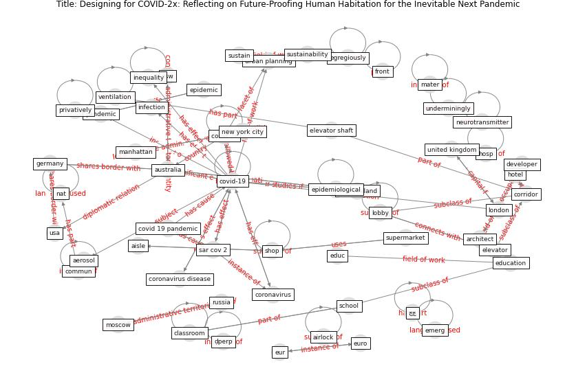

# Article: Designing for COVID-2x: Reflecting on Future-Proofing Human Habitation for the Inevitable Next Pandemic (spennemann_designing_2022)

* Source: [10.3390/buildings12070976](https://doi.org/10.3390/buildings12070976)
* Year: 2022
* Cluster: [building-space](cluster_1)

## Keywords

 * [aerosol](keyword_aerosol), air cycle, airlock, aisle, [architect](keyword_architect), [australia](keyword_australia), bathroom, be be, canberra, classroom, click and collect, commun, commute, conclusivelyconclusion, [conflict of interest](keyword_conflict_of_interest), containment, containment space, [coronavirus](keyword_coronavirus), coronavirus disease, [corridor](keyword_corridor), [covid 19 pandemic](keyword_covid_19_pandemic), covid 2x, [covid-19](keyword_covid-19), delta, dev, developer, educ, [education](keyword_education), egregiously, [elevator](keyword_elevator), elevator shaft, emerg, [epidemic](keyword_epidemic), [epidemiological](keyword_epidemiological), eur, euro, fit forpurpose, front, [germany](keyword_germany), historically, hosp, hotel, hughe m, ignatieva m, inequality, infant, infect, [infection](keyword_infection), junior, lobby, [lockdown](keyword_lockdown), [london](keyword_london), [malaysia](keyword_malaysia), [manhattan](keyword_manhattan), [mater](keyword_mater), middle aisle, moscow, nat, neurotransmitter, [new jersey](keyword_new_jersey), [new york city](keyword_new_york_city), new zealand, nsw, [office](keyword_office), omicron, [pandemic](keyword_pandemic), penang, pressure differential, privatively, regist, repatriate, [russia](keyword_russia), [sar cov 2](keyword_sar_cov_2), [school](keyword_school), [seoul](keyword_seoul), serv, [shop](keyword_shop), [society](keyword_society), supermarket, sustain, [sustainability](keyword_sustainability), tasmania, the impact of classroom design on pupil learn, train, [trenton](keyword_trenton), underminingly, [united kingdom](keyword_united_kingdom), [urban](keyword_urban), urban design, urban park usage during the covid 19 pandemic, [urban planning](keyword_urban_planning), [usa](keyword_usa), [ventilation](keyword_ventilation), ventilation system, victoria, απισισιος, چچ, چュート, ḍperp, ḯpesperous

## Concepts

 

## Neighbours

### Closest articles

* RESIDENTIAL ARCHITECTURE IN A POST-PANDEMIC WORLD: IMPLICATIONS OF COVID-19 FOR NEW CONSTRUCTION AND FOR ADAPTING HERITAGE BUILDINGS - [LINK](article_spennemann_residential_2021)
* How the Coronavirus Will Reshape Architecture - [LINK](article_chayka_how_2020)
* Houses amid COVID-19: Environmental challenges and design adaptation - [LINK](article_hizra_houses_2021)
* Adaptive Design of the Built Environment to Mitigate the Transmission Risk of COVID-19 - [LINK](article_ara_dilshad_shangi_adaptive_2020)
* COVID-19 and Green Housing: A Review of Relevant Literature - [LINK](article_kaklauskas_covid-19_2021)
* How is COVID-19 Experience Transforming Sustainability Requirements of Residential Buildings? A Review - [LINK](article_tokazhanov_how_2020)
* Antivirus-built environment: Lessons learned from Covid-19 pandemic - [LINK](article_megahed_antivirus-built_2020)
* Prophylactic Architecture: Formulating the Concept of Pandemic-Resilient Homes - [LINK](article_elrayies_prophylactic_2022)
* Impact of Covid-19 on the built environment - [LINK](article_mahima_impact_2022)

### Closest BPs

* Blueprint: Mental health – Act: Do something - [LINK](bp_18)
* Blueprint: Mental health – Belong: Do something with someone - [LINK](bp_19)
* Blueprint: Mental health – Commit: Do something meaningfull - [LINK](bp_20)
