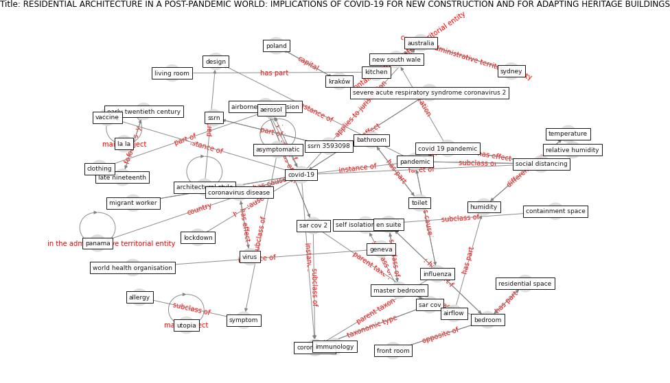

# Article: RESIDENTIAL ARCHITECTURE IN A POST-PANDEMIC WORLD: IMPLICATIONS OF COVID-19 FOR NEW CONSTRUCTION AND FOR ADAPTING HERITAGE BUILDINGS (spennemann_residential_2021)

* Source: [10.3992/jgb.16.1.199](https://doi.org/10.3992/jgb.16.1.199)
* Year: 2021
* Cluster: [building-space](cluster_9)

## Keywords

 * 1890s, 1940, 1950, abdelmaksoud, adaptive reuse, [aerosol](keyword_aerosol), [air conditioning](keyword_air_conditioning), airborne transmission, airflow, allergy, apartment building, [architectural style](keyword_architectural_style), asymptomatic, [australia](keyword_australia), ba, bastianini, bathroom, [bedroom](keyword_bedroom), bierwirth, [brazil](keyword_brazil), build stock, [canada](keyword_canada), clothing, containment space, [coronavirus](keyword_coronavirus), coronavirus disease, [covid 19 pandemic](keyword_covid_19_pandemic), [covid-19](keyword_covid-19), [design](keyword_design), [disinfection](keyword_disinfection), door, drawing room, ducte, early twentieth century, elevator, en suite, evolution, fishery, food supply chain, francis, front room, garage, geneva, geography, hand hygiene, [health](keyword_health), [humidity](keyword_humidity), immunology, [infection](keyword_infection), [influenza](keyword_influenza), kirschstein, kitchen, kraków, la la, late nineteenth, living room, [lockdown](keyword_lockdown), [logistic](keyword_logistic), master bedroom, [mer cov](keyword_mer_cov), migrant worker, mouth, navarini, [new south wale](keyword_new_south_wale), nose, panama, [pandemic](keyword_pandemic), [poland](keyword_poland), [public health](keyword_public_health), relative humidity, residential space, sar cov, [sar cov 2](keyword_sar_cov_2), self isolation, self isolation space, severe acute respiratory syndrome coronavirus 2, [social distancing](keyword_social_distancing), spennemann, ssrn, ssrn 3593098, stability, [sydney](keyword_sydney), [symptom](keyword_symptom), taylor francis, [technology](keyword_technology), [temperature](keyword_temperature), textile science, [toilet](keyword_toilet), [toronto](keyword_toronto), [tourism](keyword_tourism), [transmission](keyword_transmission), [transport](keyword_transport), [united kingdom](keyword_united_kingdom), universal design, utopia, [vaccine](keyword_vaccine), [ventilation](keyword_ventilation), [virus](keyword_virus), world health organisation, zoonotic

## Concepts

 

## Neighbours

### Closest articles

* Designing for COVID-2x: Reflecting on Future-Proofing Human Habitation for the Inevitable Next Pandemic - [LINK](article_spennemann_designing_2022)
* Adaptive Design of the Built Environment to Mitigate the Transmission Risk of COVID-19 - [LINK](article_ara_dilshad_shangi_adaptive_2020)
* Houses amid COVID-19: Environmental challenges and design adaptation - [LINK](article_hizra_houses_2021)
* How the Coronavirus Will Reshape Architecture - [LINK](article_chayka_how_2020)
* Antivirus-built environment: Lessons learned from Covid-19 pandemic - [LINK](article_megahed_antivirus-built_2020)
*  - [LINK](article_dalessandro_covid-19_2020)
* How Architecture Fails in Conditions of Crisis: a Discussion on the Value of Interior Design over the COVID-19 Outbreak - [LINK](article_rassia_how_2020)
* COVID-19 Could Leverage a Sustainable Built Environment - [LINK](article_pinheiro_covid-19_2020)
* COVID-19 Lessons for a Resilient Built Environment: A Roadmap - [LINK](article_hull_covid-19_2020)

### Closest BPs

* Blueprint: Architecture design - [LINK](bp_2)
* Blueprint: Building Adaptation during a pandemic - [LINK](bp_14)
* Blueprint: Tender support at building stage - [LINK](bp_9)
