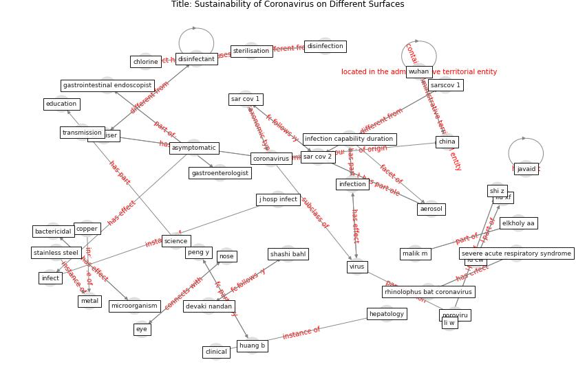

# Article: __Sustainability of Coronavirus on Different Surfaces__ (suman_sustainability_2020)

* [10.1016/j.jceh.2020.04.020](https://doi.org/10.1016/j.jceh.2020.04.020)
* Cluster: [air-sars](cluster_2)

## Keywords

[coronavirus](keyword_coronavirus), [virus](keyword_virus), [infection](keyword_infection), [aerosol](keyword_aerosol)

## Concepts

 

### References 

* [Aerosol and Surface Stability of SARS-CoV-2 as
Compared with SARS-CoV-1](article_van_doremalen_aerosol_2020)

### Cited by 

* [Blockchain technology and its applications to combat
COVID-19 pandemic](article_sharma_blockchain_2022)
