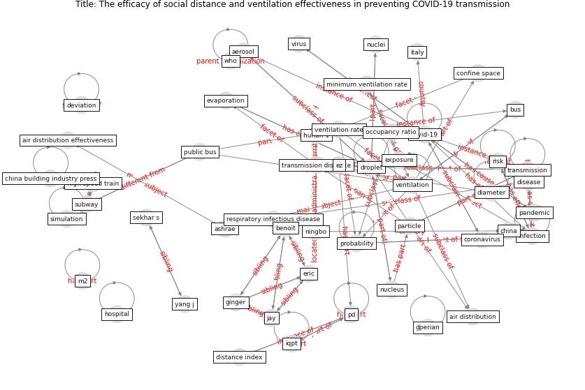

# Article: The efficacy of social distance and ventilation effectiveness in preventing COVID-19 transmission (sun_efficacy_2020)

* Source: [10.1016/j.scs.2020.102390](https://doi.org/10.1016/j.scs.2020.102390)
* Year: 2020
* Cluster: [air-uv](cluster_2)

## Keywords

 * aderibigbe, [aerosol](keyword_aerosol), air distribution, air distribution effectiveness, antibody test, [ashrae](keyword_ashrae), barker j, [beijing](keyword_beijing), benoit, [build](keyword_build), [bus](keyword_bus), [california](keyword_california), [china](keyword_china), china building industry press, confine space, [coronavirus](keyword_coronavirus), cough, [covid-19](keyword_covid-19), deviation, diameter, [disease](keyword_disease), distance, distance index, distribution, [droplet](keyword_droplet), ecological, eric, evaporate, evaporation, exhale, exhale droplet, experimental, [exposure](keyword_exposure), ez, fall time, fennelly k, ginger, gravity, high speed train, horizontal transmission distance, [hospital](keyword_hospital), hunan 1, hunan 2, indiana, [infection](keyword_infection), infective quantum q, iqpt, [italy](keyword_italy), jay, litvinova m, m2, mass, [medical](keyword_medical), minimum ventilation rate, murphy g, nielsen p v, ningbo, nuclei, nucleus, occupancy, occupancy ratio, outcome, [pandemic](keyword_pandemic), [particle](keyword_particle), pd, pi, prevention, probability, public bus, respiratory droplet, respiratory infectious disease, riley r, [risk](keyword_risk), sekhar s, [simulation](keyword_simulation), size, [social distance](keyword_social_distance), [social distancing](keyword_social_distancing), [spread](keyword_spread), [statistic](keyword_statistic), steven d, [study](keyword_study), subway, sustainable city and society, theoretical analysis, [transmission](keyword_transmission), transmission distance, [ventilation](keyword_ventilation), ventilation effectiveness, ventilation rate, [ventilation system](keyword_ventilation_system), [virus](keyword_virus), wells riley model, wellsriley model, who, winther f v, world health organization, yang j, μm, ḏperian

## Concepts

 

## Neighbours

### Closest articles

* The ventilation of buildings and other mitigating measures for COVID-19: a focus on wintertime - [LINK](article_burridge_ventilation_2021)
* Environmental factors involved in SARS-CoV-2 transmission: effect and role of indoor environmental quality in the strategy for COVID-19 infection control - [LINK](article_azuma_environmental_2020)
* A review of facilities management interventions to mitigate respiratory infections in existing buildings - [LINK](article_zhang_review_2022)
* Heating, ventilation and air-conditioning systems in the context of COVID-19 - [LINK](article_ecdc_heating_2020)
* How can airborne transmission of COVID-19 indoors be minimised? - [LINK](article_morawska_how_2020)
* 2019 Novel Coronavirus (COVID-19) Pandemic: Built Environment Considerations To Reduce Transmission - [LINK](article_dietz_2019_2020)
* Methods for air cleaning and protection of building occupants from airborne pathogens - [LINK](article_bolashikov_methods_2009)
* A critical review of heating, ventilation, and air conditioning (HVAC) systems within the context of a global SARS-CoV-2 epidemic - [LINK](article_elsaid_critical_2021)
* A Review on Building Design as a Biomedical System for Preventing COVID-19 Pandemic - [LINK](article_amran_review_2022)

### Closest BPs

* Blueprint: Installing UV in ductwork - [LINK](bp_10)
* Blueprint: Indoor Environmental Quality (IEQ) monitoring system - [LINK](bp_3)
* Blueprint: Installing high-efficiency air filters - [LINK](bp_11)
