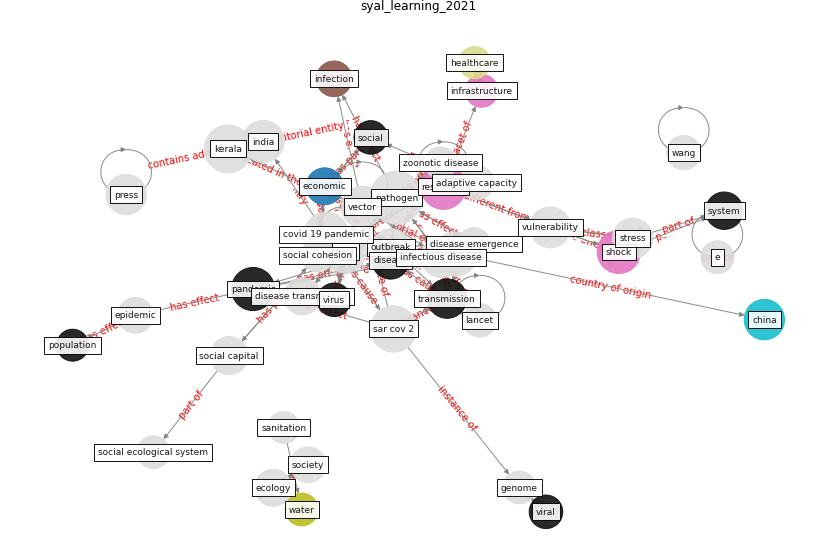

# Article: __Learning from pandemics: Applying resilience thinking to identify priorities for planning urban settlements__ (syal_learning_2021)

* [10.1016/j.jum.2021.05.004](https://doi.org/10.1016/j.jum.2021.05.004)
* Cluster: [health-city](cluster_0)

## Keywords

[resilience](keyword_resilience), [pandemic](keyword_pandemic), [shock](keyword_shock)

## Concepts

 

### References 

* [Persistence of coronaviruses on inanimate surfaces and
their inactivation with biocidal agents](article_kampf_persistence_2020)

### Cited by 

