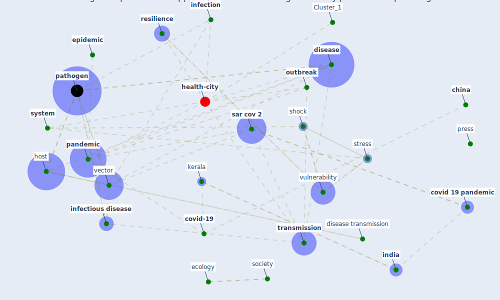

# Article: Learning from pandemics: Applying resilience thinking to identify priorities for planning urban settlements (syal_learning_2021)

* Source: [10.1016/j.jum.2021.05.004](https://doi.org/10.1016/j.jum.2021.05.004)
* Year: 2021
* Cluster: [urban-city](cluster_6)

## Keywords

 * adaptive capacity, alda vidal, andersen, anophele, begon m ward m, bioscience, bosetti, [china](keyword_china), [climate change](keyword_climate_change), clostridium bacteria, complex system, [covid 19 pandemic](keyword_covid_19_pandemic), [covid-19](keyword_covid-19), de la sen, [disease](keyword_disease), disease emergence, disease transmission, disturbance, eby, ecology, [economic](keyword_economic), [economy](keyword_economy), elamon, emergence, [epidemic](keyword_epidemic), [epidemiology](keyword_epidemiology), evolution, fan, food supply chain, fеevre e hassell j, [genome](keyword_genome), habitat encroachment, [healthcare](keyword_healthcare), hochberg, hordijk, host, [human health](keyword_human_health), hygiene, [india](keyword_india), infect, [infection](keyword_infection), infectious, [infectious disease](keyword_infectious_disease), infectiousness, infector, [infrastructure](keyword_infrastructure), island press, [kampf](keyword_kampf), [kerala](keyword_kerala), kronmann, lefrancq, legionella pneumophila, legionnaire disease, literature, livelihood, [malaria](keyword_malaria), [management](keyword_management), martin, mathematical, miller, ostfeld r, [outbreak](keyword_outbreak), [pandemic](keyword_pandemic), [pathogen](keyword_pathogen), [personal protective equipment](keyword_personal_protective_equipment), plowright, [population](keyword_population), press, [public health](keyword_public_health), rambaut, replication, [research](keyword_research), reservoir, [resilience](keyword_resilience), risk factor, robb, robustness, [sanitation](keyword_sanitation), [sar cov 2](keyword_sar_cov_2), science, [shock](keyword_shock), [social](keyword_social), [society](keyword_society), specific, [stress](keyword_stress), [surveillance](keyword_surveillance), [system](keyword_system), [transmission](keyword_transmission), trust, urban design, urbanization, [vector](keyword_vector), [viral](keyword_viral), [virus](keyword_virus), [vulnerability](keyword_vulnerability), [water](keyword_water), world, zoonosis, zoonotic, zoonotic disease

## Concepts

 

## Neighbours

### Closest articles

* COVID-19 Pandemic: Rethinking Strategies for Resilient Urban Design, Perceptions, and Planning - [LINK](article_afrin_covid-19_2021)
* The COVID-19 pandemic: Impacts on cities and major lessons for urban planning, design, and management - [LINK](article_sharifi_covid-19_2020)
* Respiratory pandemics, urban planning and design: A multidisciplinary rapid review of the literature - [LINK](article_harris_respiratory_2022)
* Coronavirus questions that will not go away: interrogating urban and socio-spatial implications of COVID-19 measures - [LINK](article_salama_coronavirus_2020)
* The Impact of COVID-19 on Public Space: A Review of the Emerging Questions - [LINK](article_honey-roses_impact_2020)
* The Role of Architecture and Urbanism in Preventing Pandemics - [LINK](article_kumar_role_2021)
* Epidemics, Planning and the City: A Special Issue of Planning Perspectives - [LINK](article_davis_epidemics_2022)
* Pandemic stricken cities on lockdown. Where are our planning and design professionals [now, then and into the future]? - [LINK](article_allam_pandemic_2020)
* Impact of Covid-19 on the built environment - [LINK](article_mahima_impact_2022)
* On the Coronavirus (COVID-19) Outbreak and the Smart City Network: Universal Data Sharing Standards Coupled with Artificial Intelligence (AI) to Benefit Urban Health Monitoring and Management - [LINK](article_allam_coronavirus_2020)

### Closest BPs

* Blueprint: Mental health – Act: Do something - [LINK](bp_18)
* Blueprint: Mental health – Belong: Do something with someone - [LINK](bp_19)
* Blueprint: Mental health – Commit: Do something meaningfull - [LINK](bp_20)
