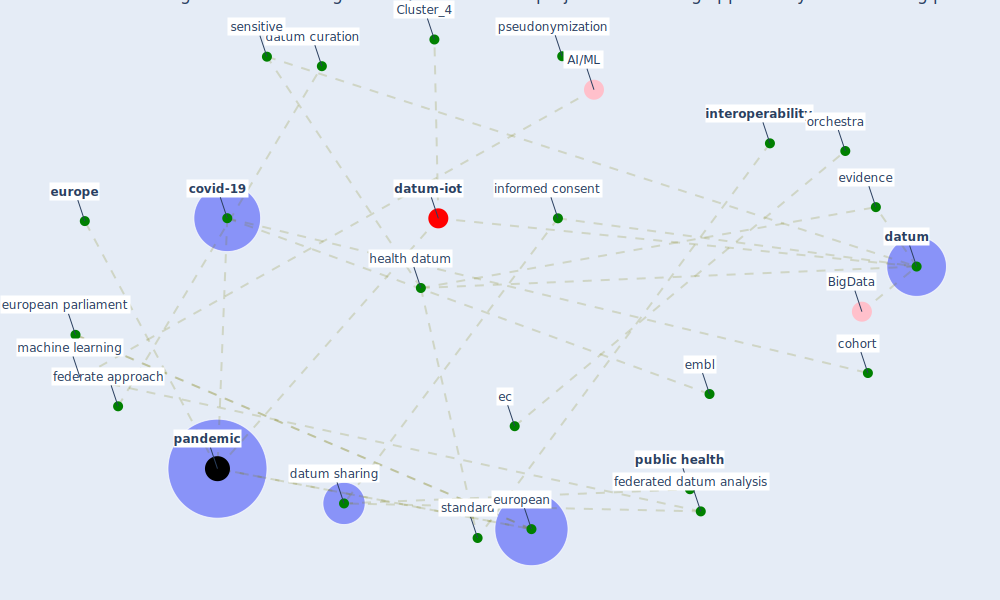

# Article: Challenges of data sharing in European Covid-19 projects: A learning opportunity for advancing pandemic preparedness and response (tacconelli_challenges_2022)

* Source: [10.1016/j.lanepe.2022.100467](https://doi.org/10.1016/j.lanepe.2022.100467)
* Year: 2022
* Cluster: [datum-iot](cluster_4)

## Keywords

 * 22 bergeron j, 25 jung rg, 29 fortier I, 38 marcon y, access point, ag, [analysis](keyword_analysis), antwerp, [barcelona](keyword_barcelona), bias, biol, bishop t, broad cohort, brussels, cell, centralise, cj, clinical, [cohort](keyword_cohort), cohort datum, cohort study, consortium, cordis, cordis org, [covid 19 pandemic](keyword_covid_19_pandemic), [covid-19](keyword_covid-19), [datum](keyword_datum), datum collection, datum curation, datum harmonisation, datum harmonization, datum management, [datum protection](keyword_datum_protection), datum scientist, [datum sharing](keyword_datum_sharing), [disease](keyword_disease), ec, electronic health record, embl, [epidemiological](keyword_epidemiological), [europe](keyword_europe), european, european commission, european health datum space, european health union, european parliament, [evidence](keyword_evidence), federate, federate approach, federate learning, federated datum analysis, federated datum infrastructure, first draft, genom, genovese, gloria soriano, haro jm, [health](keyword_health), health datum, [health system](keyword_health_system), heterogeneity, icd 10, [infectious disease](keyword_infectious_disease), informatic, informed consent, integrate care, [interoperability](keyword_interoperability), [italy](keyword_italy), j be me informat assoc, kubiak c, longitudinal, machine learning, maelstrom, me informat assoc, [member state](keyword_member_state), merten e, meta harmonization, metadata, molecular database, [network](keyword_network), node, norway, orchestra, orchestra cohort, oslo, [pandemic](keyword_pandemic), parallelization, pseudonymization, [public health](keyword_public_health), raina p, response, sensitive, sm, [spain](keyword_spain), [standard](keyword_standard), terminology code, uncover, university of barcelona, university of verona, zikalliance

## Concepts

 

## Neighbours

### Closest articles

* 2020 Data Protection Report - [LINK](article_council_of_europe_2020_2020)
* Borders and Catastrophe: lessons from COVID-19 for the European Green Deal - [LINK](article_klein_borders_2021)
* How drones help cities during the Covid-19 pandemic \textbar TheMayor.EU - [LINK](article_dimitrova_how_2021)
* Strengthening resilience: a priority shared by Health 2020 and - [LINK](article_who_strengthening_2017)
* Drones. Disinfecting robots. Supercomputers. The coronavirus outbreak is a test for China's tech industry \textbar CNN Business - [LINK](article_wang_drones_2020)
* China adapts survey drones to enforce world’s largest quarantine - [LINK](article_liu_china_2020)
* Understanding the role of urban design in disease spreading - [LINK](article_brizuela_understanding_2019)
* <scp>COVID</scp>             ‐19: Small and medium enterprises challenges and responses with creativity, innovation, and entrepreneurship - [LINK](article_thukral_covid19_2021)

### Closest BPs

* Blueprint: Smart Locker System - [LINK](bp_1)
* Blueprint: Monitoring of wastewater - [LINK](bp_21)
* Blueprint: Mental health – Belong: Do something with someone - [LINK](bp_19)
