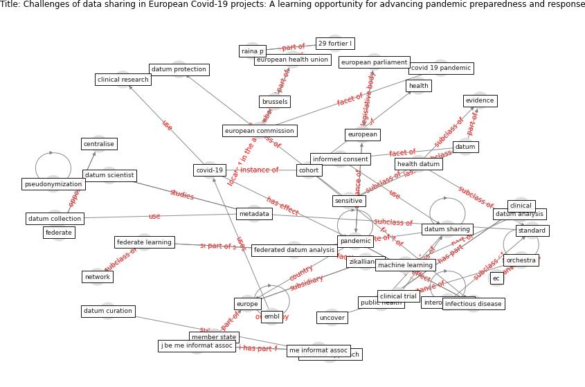

# Article: __Challenges of data sharing in European Covid-19 projects: A learning opportunity for advancing pandemic preparedness and response__ (tacconelli_challenges_2022)

* [10.1016/j.lanepe.2022.100467](https://doi.org/10.1016/j.lanepe.2022.100467)
* Cluster: [om-ai](cluster_1)

## Keywords

[pandemic](keyword_pandemic), [interoperability](keyword_interoperability)

## Concepts

 

