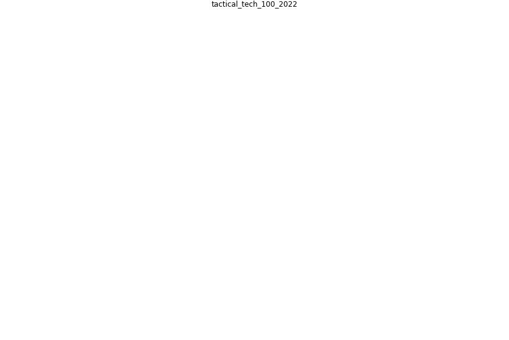

# Article: __100 Pandemic Technologies__ (tactical_tech_100_2022)

* URL: [https://techpandemic.theglassroom.org/#kinetic-contact-tracing](https://techpandemic.theglassroom.org/#kinetic-contact-tracing)
* Year: 2022
* Abstract: This research project presents a selection from the
hundreds of data-driven technologies used around the world
to combat the pandemic. The curation of examples presented
in Technologies of Hope have been chosen to represent the
breadth of sectors, products and ideas that seek to offer
solutions for a wide range of pandemic related problems.

## Keywords

* 0 0 point, supply chain distruption, supply chain design, supply chain decision make complexity, supply chain decision make, supply chain complication, supply chain account, supply chain 4 0, [supply chain](keyword_supply_chain), supply base, supply as much outdoor air as possible, supply and production chain, supply and production, supply and distribution chain, supply and demand planning

## Keywords at large

* [biophilic design](keyword_biophilic_design), [architecture](keyword_architecture), [sustainable architecture](keyword_sustainable_architecture), [nature](keyword_nature), [design](keyword_design), [biophilic](keyword_biophilic), [environ](keyword_environ), [biophilia](keyword_biophilia), [wellbeing](keyword_wellbeing), [health](keyword_health)

## Concepts

 

