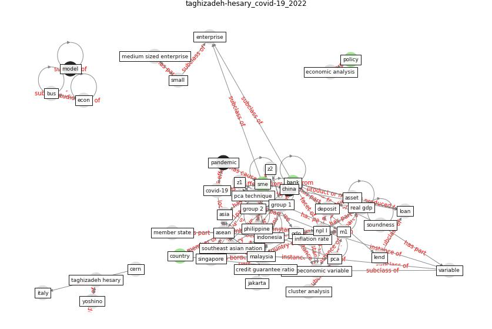

# Article: __COVID-19 and regional solutions for mitigating the risk of SME finance in selected ASEAN member states__ (taghizadeh-hesary_covid-19_2022)

* [10.1016/j.eap.2022.03.012](https://doi.org/10.1016/j.eap.2022.03.012)
* Cluster: [resilience-infrastructure](cluster_9)

## Keywords

[policy](keyword_policy)

## Concepts

 

### References 

* [Startups in times of crisis – A rapid response to the
COVID-19 pandemic](article_kuckertz_startups_2020)

### Cited by 

