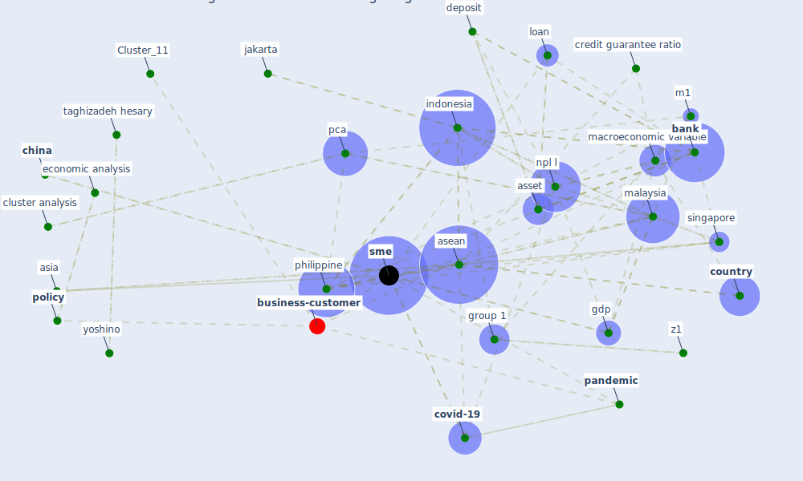

# Article: COVID-19 and regional solutions for mitigating the risk of SME finance in selected ASEAN member states (taghizadeh-hesary_covid-19_2022)

* Source: [10.1016/j.eap.2022.03.012](https://doi.org/10.1016/j.eap.2022.03.012)
* Year: 2022
* Cluster: [construction-pandemic](cluster_1)

## Keywords

 * archer, [asean](keyword_asean), asia, [asset](keyword_asset), author calculation, [bank](keyword_bank), bank level variable, borrower, [bus](keyword_bus), [business](keyword_business), calculation, cern, [china](keyword_china), cluster analysis, component, [coronavirus](keyword_coronavirus), [country](keyword_country), [covid 19 pandemic](keyword_covid_19_pandemic), [covid-19](keyword_covid-19), credit constraint, credit guarantee, credit guarantee ratio, credit risk, [crisis](keyword_crisis), default risk ratio, deposit, develop country, econometric, economic analysis, economic analysis and policy, emerge, emergency stage, employment, enterprise, [europe](keyword_europe), european sme, factor, finance, gdp, [government](keyword_government), group 1, group 2, guarantee ratio, [indonesia](keyword_indonesia), inflation rate, interest rate, [italy](keyword_italy), jakarta, kanagawa, kpss test, l1, land price, lend, lender, loan, m1, macroeconomic, macroeconomic variable, [malaysia](keyword_malaysia), malaysian bank, medium sized enterprise, [member state](keyword_member_state), [model](keyword_model), npl l, npl ratio, npls, [oecd](keyword_oecd), [pandemic](keyword_pandemic), paris, pca, pca technique, peke university, philippine, [policy](keyword_policy), pp test, procedure, rd, re j, singapore, small, [sme](keyword_sme), sme financing, soundness, southeast asian nation, spss, strategist, strategy, [study](keyword_study), [switzerland](keyword_switzerland), taghizadeh hesary, variable, vector autoregressive, [world bank](keyword_world_bank), world bank database, worldbank, yoshino, z1, z2, α1, ρl

## Concepts

 

## Neighbours

### Closest articles

* World Bank Development Report - [LINK](article_world_bank_world_2022)
* Covid-19 and asset management in EU: a preliminary assessment of performance and investment styles - [LINK](article_rizvi_covid-19_2020)
* Building sustainable finance for resilient protected and conserved areas: lessons from COVID-19 - [LINK](article_cumming_building_2021)
* <scp>COVID</scp>             ‐19: Small and medium enterprises challenges and responses with creativity, innovation, and entrepreneurship - [LINK](article_thukral_covid19_2021)
* Startups in times of crisis – A rapid response to the COVID-19 pandemic - [LINK](article_kuckertz_startups_2020)
* Global value chains: Efficiency and risks in the context of COVID-19 - [LINK](article_oecd_global_2021)
* The socio-economic implications of the coronavirus pandemic (COVID-19): A review - [LINK](article_nicola_socio-economic_2020)
* Mapping research in logistics and supply chain management during COVID-19 pandemic - [LINK](article_montoya-torres_mapping_2021)
* Urban design attributes and resilience: COVID-19 evidence from New York City - [LINK](article_yang_urban_2021)

### Closest BPs

* Blueprint: Smart Locker System - [LINK](bp_1)
* Blueprint: Monitoring of wastewater - [LINK](bp_21)
* Blueprint: Resilience in staffing and skills training - [LINK](bp_12)
