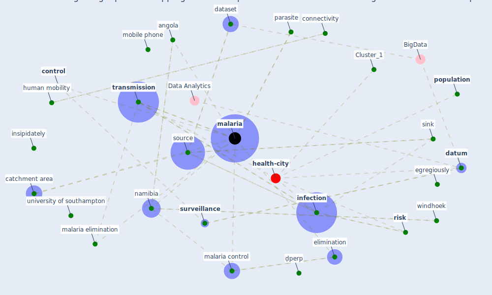

# Article: Integrating rapid risk mapping and mobile phone call record data for strategic malaria elimination planning (tatem_integrating_2014)

* Source: [10.1186/1475-2875-13-52](https://doi.org/10.1186/1475-2875-13-52)
* Year: 2014
* Cluster: [malaria-vector](cluster_13)

## Keywords

 * [algorithm](keyword_algorithm), angola, [area](keyword_area), artemisinin, asymptomatic, barabasi al, border, caprivi, catchment area, census, [china](keyword_china), communications regulatory authority, [community](keyword_community), compete interest, connectivity, [control](keyword_control), crosses, [dataset](keyword_dataset), [datum](keyword_datum), deichmann u, egregiously, [elimination](keyword_elimination), elimination strategies, elith j, endemic, extractions, gainesville fl, geneva, gosling, gosling rd, graham ch, group, haiti, health district, hotspot, human mobility, immunity, importation, importers, [india](keyword_india), [infection](keyword_infection), insipidately, intervention, kavango, [kenya](keyword_kenya), kilifi, klepac p, location, [malaria](keyword_malaria), malaria control, malaria elimination, metcalf je, mobile phone, mobile phone network, [mobility](keyword_mobility), movement, [namibia](keyword_namibia), neighbourhood, net exporters, [network](keyword_network), noor am, nvdcp, omusati, parasite, peke university, phone, plasmodium falciparum, [population](keyword_population), qu z, rainfall, rdt confirmed cases, region, [risk](keyword_risk), risk map, risk mapping, sink, song c, source, [south africa](keyword_south_africa), spatially, [surveillance](keyword_surveillance), swaziland, [switzerland](keyword_switzerland), tatem aj, testing, [transmission](keyword_transmission), [united kingdom](keyword_united_kingdom), [united nations](keyword_united_nations), university of florida, university of southampton, urban area, [usa](keyword_usa), windhoek, [world health organization](keyword_world_health_organization), yetman g, ابته, ابعد, بته, ḍperp, ḯpesk

## Concepts

 

## Neighbours

### Closest articles

* Decision Making within the Built Environment as a Strategy for Mitigating the Risk of Malaria and Other Vector-Borne Diseases - [LINK](article_obonyo_decision_2018)
* Addressing vulnerability, building resilience: community-based adaptation to vector-borne diseases in the context of global change - [LINK](article_bardosh_addressing_2017)
* Prototype Early Warning Systems for Vector-Borne Diseases in Europe - [LINK](article_semenza_prototype_2015)
* The impact of climate change on the epidemiology and control of Rift Valley fever - PubMed - [LINK](article_martin_impact_2008)
* Vector-borne disease, climate change and urban design - [LINK](article_ogden_vector-borne_2016)
* Challenges to Mitigating the Urban Health Burden of Mosquito-Borne Diseases in the Face of Climate Change - [LINK](article_ligsay_challenges_2021)
* Global policy challenges for urban vector-borne disease risks - [LINK](article_alabaster_global_2016)
* Making green infrastructure healthier infrastructure - [LINK](article_lohmus_making_2015)
* Green infrastructure through the lens of “One Health”: A systematic review and integrative framework uncovering synergies and trade-offs between mental health and wildlife support in cities - [LINK](article_felappi_green_2020)
* The Emergence of Anti-Privacy and Control at the Nexus between the Concepts of Safe City and Smart City - [LINK](article_allam_emergence_2019)

### Closest BPs

* Blueprint: Mental health – Act: Do something - [LINK](bp_18)
* Blueprint: Mental health – Commit: Do something meaningfull - [LINK](bp_20)
* Blueprint: Mental health – Belong: Do something with someone - [LINK](bp_19)
