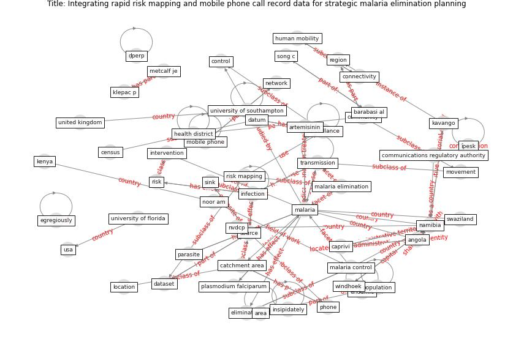

# Article: Integrating rapid risk mapping and mobile phone call record data for strategic malaria elimination planning (tatem_integrating_2014)

* Source: [10.1186/1475-2875-13-52](https://doi.org/10.1186/1475-2875-13-52)
* Year: 2014
* Cluster: [malaria-vector](cluster_12)

## Keywords

 * [algorithm](keyword_algorithm), angola, [area](keyword_area), artemisinin, asymptomatic, barabasi al, border, caprivi, catchment area, census, [china](keyword_china), communications regulatory authority, [community](keyword_community), compete interest, connectivity, [control](keyword_control), crosses, [dataset](keyword_dataset), [datum](keyword_datum), deichmann u, egregiously, [elimination](keyword_elimination), elith j, endemic, extractions, gainesville fl, geneva, gosling, gosling rd, graham ch, group, haiti, health district, high risk area, hotspot, human mobility, importation, importers, [infection](keyword_infection), insipidately, interrupted transmission, intervention, kavango, [kenya](keyword_kenya), kilifi, klepac p, lefebvre e, location, [malaria](keyword_malaria), malaria control, malaria elimination, metcalf je, mobile phone, mobile phone network, [mobility](keyword_mobility), move comm, movement, [nairobi](keyword_nairobi), [namibia](keyword_namibia), neighbourhood, net exporter, [network](keyword_network), noor am, nvdcp, omusati, parasite, peke university, phone, plasmodium falciparum, [population](keyword_population), rainfall, rdt confirmed cases, region, [risk](keyword_risk), risk map, risk mapping, sink, song c, source, [south africa](keyword_south_africa), spatially, [surveillance](keyword_surveillance), swaziland, [switzerland](keyword_switzerland), [transmission](keyword_transmission), [united kingdom](keyword_united_kingdom), university of florida, university of southampton, [urban area](keyword_urban_area), [usa](keyword_usa), [vector](keyword_vector), windhoek, [world health organization](keyword_world_health_organization), yetman g, ابته, بته, بعد, ḍperp, ḍיכ, ḯpesk

## Concepts

 

## Neighbours

### Closest articles

* Decision Making within the Built Environment as a Strategy for Mitigating the Risk of Malaria and Other Vector-Borne Diseases - [LINK](article_obonyo_decision_2018)
* Addressing vulnerability, building resilience: community-based adaptation to vector-borne diseases in the context of global change - [LINK](article_bardosh_addressing_2017)
* Prototype Early Warning Systems for Vector-Borne Diseases in Europe - [LINK](article_semenza_prototype_2015)
* The impact of climate change on the epidemiology and control of Rift Valley fever - PubMed - [LINK](article_martin_impact_2008)
* Vector-borne disease, climate change and urban design - [LINK](article_ogden_vector-borne_2016)
* Challenges to Mitigating the Urban Health Burden of Mosquito-Borne Diseases in the Face of Climate Change - [LINK](article_ligsay_challenges_2021)
* Design COVID-19 Ontology: A Healthcare and Safety Perspective - [LINK](article_aloulou_design_2022)
* How the 5G Enabled the COVID-19 Pandemic Prevention and Control: Materiality, Affordance, and (De-)Spatialization - [LINK](article_li_how_2022)
* CIDO, a community-based ontology for coronavirus disease knowledge and data integration, sharing, and analysis - [LINK](article_he_cido_2020)
* An Overview of Biomedical Ontologies for Pandemics and Infectious Diseases Representation - [LINK](article_bayoudhi_overview_2021)

### Closest BPs

* Blueprint: Installing high-efficiency air filters - [LINK](bp_11)
* Blueprint: Resilience in staffing and skills training - [LINK](bp_12)
* Blueprint: Monitoring of wastewater [CID] - [LINK](bp_21)
