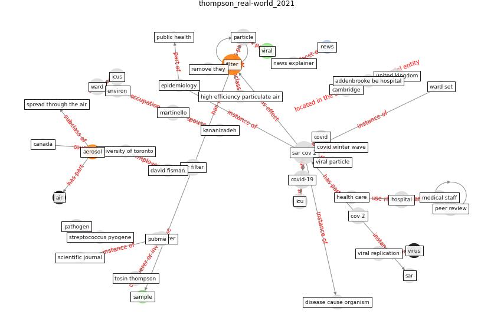

# Article: __Real-world data show that filters clean COVID-causing virus from air__ (thompson_real-world_2021)

* [10.1038/d41586-021-02669-2](https://doi.org/10.1038/d41586-021-02669-2)
* Cluster: [air-sars](cluster_2)

## Keywords

[filter](keyword_filter), [viral](keyword_viral), [virus](keyword_virus)

## Abstract

An inexpensive type of portable filter efficiently
screened SARS-CoV-2 and other disease-causing organisms
from hospital air.

## Concepts

 

