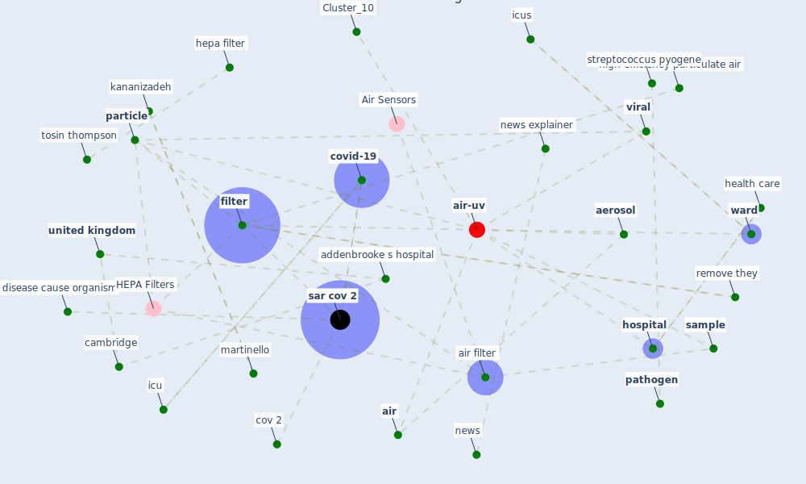

# Article: Real-world data show that filters clean COVID-causing virus from air (thompson_real-world_2021)

* Source: [10.1038/d41586-021-02669-2](https://doi.org/10.1038/d41586-021-02669-2)
* Year: 2021
* Cluster: [air-uv](cluster_10)

## Keywords

 * addenbrooke s hospital, [aerosol](keyword_aerosol), [air](keyword_air), [air filter](keyword_air_filter), air sample, cambridge, [canada](keyword_canada), cov 2, covid 19 ward, covid winter wave, [covid-19](keyword_covid-19), david fisman, disease cause organism, epidemiologist, [epidemiology](keyword_epidemiology), [filter](keyword_filter), fine mesh, [health care](keyword_health_care), hepa filter, high efficiency particulate air, [hospital](keyword_hospital), [icu](keyword_icu), icus, [infection](keyword_infection), kananizadeh, martinello, nature nature issn, [news](keyword_news), news explainer, [particle](keyword_particle), particle in the air, particulate air, [pathogen](keyword_pathogen), protein, [public health](keyword_public_health), remove inactive particle, remove they, [sample](keyword_sample), sar cov, [sar cov 2](keyword_sar_cov_2), science, spread through the air, springer nature limit, streptococcus pyogene, technol sci, tosin thompson, [united kingdom](keyword_united_kingdom), university of toronto, [viral](keyword_viral), [ward](keyword_ward), ward set

## Concepts

 

## Neighbours

### Closest articles

* The Effect of Opening Windows on Air Change Rates in Two Homes - [LINK](article_howard-reed_effect_2002)
* Characterization and performance evaluation of a full-scale activated carbon-based dynamic botanical air filtration system for improving indoor air quality - [LINK](article_wang_characterization_2011)
* Touchless Retail: What the Rest of the World could learn from China’s new ways to shop - [LINK](article_capgemini_touchless_2020)
* Retail Signage During the COVID-19 Pandemic - [LINK](article_mcneish_retail_2020)
* How COVID-19 Could Accelerate the Adoption of New Retail Technologies and Enhance the (E-)Servicescape - [LINK](article_willems_how_2021)
* The effect of a redesigned floor plan, occupant density and the quality of indoor climate on the cost of space, productivity and sick leave in an office building–A case study - [LINK](article_saari_effect_2006)

### Closest BPs

* Blueprint: Installing high-efficiency air filters - [LINK](bp_11)
* Blueprint: Air Cleaning Plants - [LINK](bp_15)
* Blueprint: Antimicrobial Surfaces - [LINK](bp_5)
