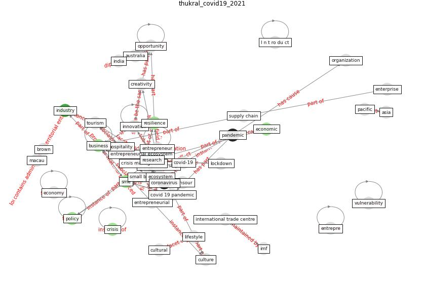

# Article: <scp>COVID</scp>            ‐19: Small and medium enterprises challenges and responses with creativity, innovation, and entrepreneurship (thukral_covid19_2021)

* Source: [10.1002/jsc.2399](https://doi.org/10.1002/jsc.2399)
* Year: 2021
* Cluster: [construction-resilience](cluster_5)

## Keywords

 * 2 coronavirus, I n t ro du ct, asia, [australia](keyword_australia), b baldwin c pourreza s randall w nowicki d 2017, behavior, bertrand m cullen z glaeser e l luca m stanton, brown, [business](keyword_business), business environment, business process, [change](keyword_change), [coronavirus](keyword_coronavirus), [covid 19 pandemic](keyword_covid_19_pandemic), [covid-19](keyword_covid-19), creativity, [crisis](keyword_crisis), crisis management, cultural, culture, current crisis, delay, [economic](keyword_economic), economic policy, [economy](keyword_economy), [ecosystem](keyword_ecosystem), [engineering](keyword_engineering), enterprise, entrepre, [entrepreneur](keyword_entrepreneur), entrepreneurial, entrepreneurial action, entrepreneurial ecosystem, [entrepreneurship](keyword_entrepreneurship), expectation, fallout, fang, fdi, filli, financial capital, founder, ghana green, [global](keyword_global), growth, have, hospitality, imf, [india](keyword_india), [indonesia](keyword_indonesia), [industry](keyword_industry), innovate, [innovation](keyword_innovation), international trade centre, j morelix, kuckertz, lifestyle, [lockdown](keyword_lockdown), macau, macro level, management, mansour, [marketing](keyword_marketing), micro, opportunity, organization, out to entrepreneur, pacific, [pandemic](keyword_pandemic), [policy](keyword_policy), post crisis economic recovery, professional service, renaldi, rentschler, [research](keyword_research), [resilience](keyword_resilience), small, small business, small business administration, small business development center, [sme](keyword_sme), snv, sociology of sport, sport industry, startup ecosystem, startup in time of crisis, startup survey, stop interrupt, strategic, strategic change, sulawesi, [supply chain](keyword_supply_chain), supply chain disruption, sustainable growth, [system](keyword_system), technological, [tourism](keyword_tourism), tourism industry, useful, [vulnerability](keyword_vulnerability), waal

## Concepts

 

## Neighbours

### Closest articles

* Startups in times of crisis – A rapid response to the COVID-19 pandemic - [LINK](article_kuckertz_startups_2020)
* COVID-19 and regional solutions for mitigating the risk of SME finance in selected ASEAN member states - [LINK](article_taghizadeh-hesary_covid-19_2022)
* World Bank Development Report - [LINK](article_world_bank_world_2022)
* How COVID-19 Could Accelerate the Adoption of New Retail Technologies and Enhance the (E-)Servicescape - [LINK](article_willems_how_2021)
* Retail Signage During the COVID-19 Pandemic - [LINK](article_mcneish_retail_2020)
* Global value chains: Efficiency and risks in the context of COVID-19 - [LINK](article_oecd_global_2021)
* Covid-19 and asset management in EU: a preliminary assessment of performance and investment styles - [LINK](article_rizvi_covid-19_2020)
* Mapping research in logistics and supply chain management during COVID-19 pandemic - [LINK](article_montoya-torres_mapping_2021)
* Touchless Retail: What the Rest of the World could learn from China’s new ways to shop - [LINK](article_capgemini_touchless_2020)

### Closest BPs

* Blueprint: Smart Locker System - [LINK](bp_1)
* Blueprint: Rotational Shift System - [LINK](bp_0)
* Blueprint: One-way mobility circulation - [LINK](bp_4)
