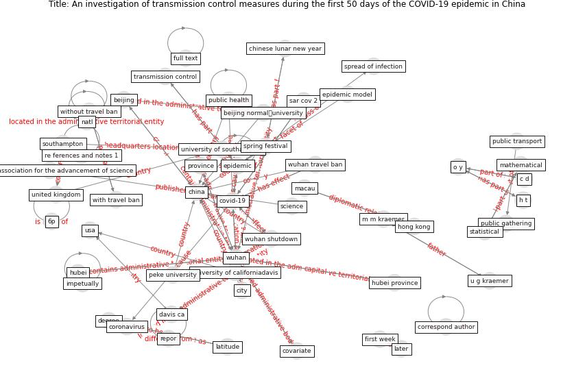

# Article: An investigation of transmission control measures during the first 50 days of the COVID-19 epidemic in China (tian_investigation_2020)

* Source: [10.1126/science.abb6105](https://doi.org/10.1126/science.abb6105)
* Year: 2020
* Cluster: [city-health](cluster_14)

## Keywords

 * 0 01 己评, 6p, american association for the advancement of science, antipersonal, [beijing](keyword_beijing), beijing normal工university, boston ma, c c viboud, c d, c h w, [china](keyword_china), chinese emergency system, chinese lunar new year, chinese lunar newyear, [city](keyword_city), compete interest, [coronavirus](keyword_coronavirus), correspond author, covariate, [covid-19](keyword_covid-19), datum collection, davis ca, degree, [epidemic](keyword_epidemic), epidemic model, extremely serious incident, first week, fitted regression, full text, generalized linear regression, h t, halt, harvarduniversity, [hong kong](keyword_hong_kong), [hubei](keyword_hubei), hubei province, impetually, incidence, [infection](keyword_infection), infectious tamadradisease, intracity public transport, j h t y, later, latitude, lbs, line, lu, m m kraemer, macau, mathematical, military logistics research program, [model](keyword_model), natl, new york avenue, o y, observation, oxford martin school, p w hayden, peke university, [protocol](keyword_protocol), [province](keyword_province), [public](keyword_public), public gathering, [public health](keyword_public_health), [public transport](keyword_public_transport), r r lu, re ferences and notes 1, repor, reversed, s2, s4, [sar cov 2](keyword_sar_cov_2), science, severe acute respiratory sympsyndrome coronavirus 2, southampton, spread of infection, spring festival, statistical, supply, t h, tao, tencent, the author, tian, tianhuaiyu, transmission control, tsinghua university, u g kraemer, [united kingdom](keyword_united_kingdom), university of californiadavis, university of southampton, university park pa, [usa](keyword_usa), viboud, [washington dc](keyword_washington_dc), with travel ban, [without travel ban](keyword_without_travel_ban), [wuhan](keyword_wuhan), wuhan shutdown, wuhan travel ban

## Concepts

 

## Neighbours

### Closest articles

* The effect of human mobility and control measures on the COVID-19 epidemic in China - [LINK](article_kraemer_effect_2020)
* Open-source analytics tools for studying the COVID-19 coronavirus outbreak - [LINK](article_wu_open-source_2020)
* Health, Economic and Social Development Challenges of the COVID-19 Pandemic: Strategies for Multiple and Interconnected Issues - [LINK](article_panneer_health_2022)
* How COVID-19 Redefines the Concept of Sustainability - [LINK](article_hakovirta_how_2020)
* COVID-19 and the UN Sustainable Development Goals: Threat to Solidarity or an Opportunity? - [LINK](article_leal_filho_covid-19_2020)
* COVID-19 Bulletin 1: Alterations to BREEAM assessment requirements as a result of the Coronavirus pandemic – Knowledge Base - [LINK](article_breeam_covid-19_2020)
* COVID-19: IMPACT OF THE PANDEMIC ON THE SUSTAINABLE DEVELOPMENT GOALS - [LINK](article_samout_covid-19_2020)
* The COVID-19 pandemic: Lessons on building more equal and sustainable societies - [LINK](article_van_barneveld_covid-19_2020)
* How COVID-19 Could Accelerate the Adoption of New Retail Technologies and Enhance the (E-)Servicescape - [LINK](article_willems_how_2021)
* Touchless Retail: What the Rest of the World could learn from China’s new ways to shop - [LINK](article_capgemini_touchless_2020)

### Closest BPs

* Blueprint: Smart Locker System - [LINK](bp_1)
* Blueprint: One-way mobility circulation - [LINK](bp_4)
* Blueprint: Rotational Shift System - [LINK](bp_0)
