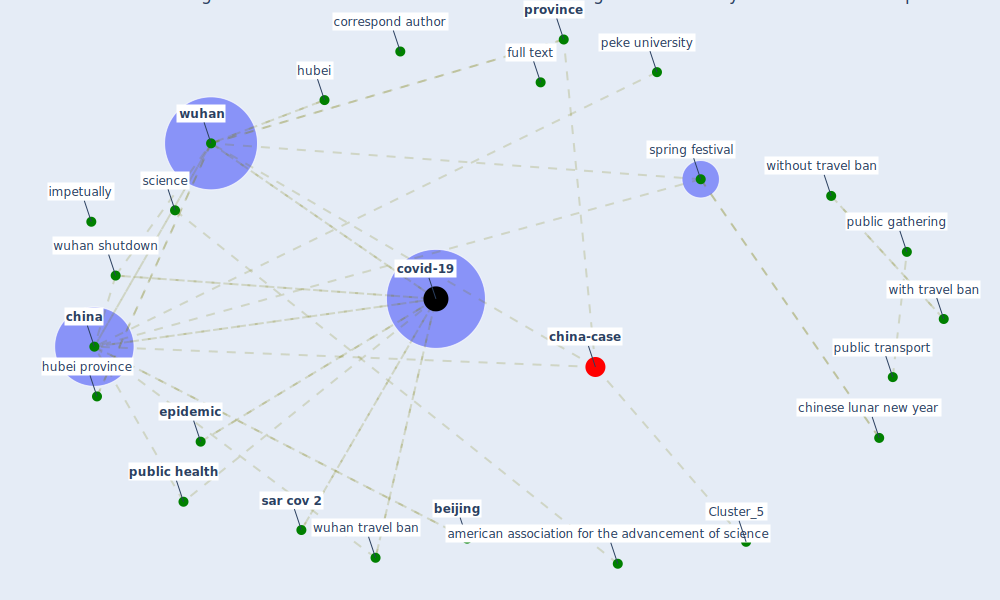

# Article: An investigation of transmission control measures during the first 50 days of the COVID-19 epidemic in China (tian_investigation_2020)

* Source: [10.1126/science.abb6105](https://doi.org/10.1126/science.abb6105)
* Year: 2020
* Cluster: [health-city](cluster_1)

## Keywords

 * 0 01 己评, 6p, american association for the advancement of science, [analysis](keyword_analysis), antipersonal, [beijing](keyword_beijing), beijing normal工university, bio protocol, boston ma, c c viboud, c d, c h w, [china](keyword_china), chinese emergency system, chinese lunar new year, chinese lunar newyear, [city](keyword_city), [coronavirus](keyword_coronavirus), correspond author, covariate, [covid-19](keyword_covid-19), davis ca, degree, [epidemic](keyword_epidemic), epidemic model, extremely serious incident, first week, fitted regression, full text, generalized linear regression, h t, halt, harvarduniversity, [hong kong](keyword_hong_kong), [hubei](keyword_hubei), hubei province, impetually, incidence, [infection](keyword_infection), infectious tamadradisease, intracity public transport, j h t y, later, latitude, lbs, line, lu, m m kraemer, macau, mathematical, military logistics research program, [model](keyword_model), natl, new york avenue, o y, oxford martin school, p w hayden, peke university, [protocol](keyword_protocol), [province](keyword_province), [public](keyword_public), public gathering, [public health](keyword_public_health), [public transport](keyword_public_transport), r r lu, re ferences and notes 1, repor, reversed, s2, s4, [sar cov 2](keyword_sar_cov_2), science, southampton, spread of infection, spring festival, st paul s hospital, statistical, [supply](keyword_supply), t h, tao, tencent, the author, tian, tianhuaiyu, transmission control, tsinghua university, u g kraemer, [united kingdom](keyword_united_kingdom), university of californiadavis, university of southampton, university park pa, [usa](keyword_usa), viboud, [washington dc](keyword_washington_dc), with travel ban, [without travel ban](keyword_without_travel_ban), wu, [wuhan](keyword_wuhan), wuhan shutdown, wuhan travel ban

## Concepts

 

## Neighbours

### Closest articles

* The effect of human mobility and control measures on the COVID-19 epidemic in China - [LINK](article_kraemer_effect_2020)
* Open-source analytics tools for studying the COVID-19 coronavirus outbreak - [LINK](article_wu_open-source_2020)
*  - [LINK](article_mehtab_alam_role_2021)
* Study of COVID-19 pandemic in London (UK) from urban context - [LINK](article_ghosh_study_2020)
* Coronavirus: Can artificial intelligence be smart enough to detect fake news? - [LINK](article_tong_coronavirus_2020)
* Climate and the spread of COVID-19 - [LINK](article_chen_climate_2021)
* Infodemic and the spread of fake news in the COVID-19-era - [LINK](article_orso_infodemic_2020)
* COVID-19 misinformation: Accuracy of articles about coronavirus prevention mostly shared on social media - [LINK](article_obiala_covid-19_2021)
* Effects of temperature and humidity on the spread of COVID-19: A systematic review - [LINK](article_mecenas_effects_2020)
* Covid-19 and community mitigation strategies in a pandemic - [LINK](article_ebrahim_covid-19_2020)

### Closest BPs

* Blueprint: Resilience in staffing and skills training - [LINK](bp_12)
* Blueprint: Installing UV in ductwork - [LINK](bp_10)
* Blueprint: Negative pressure rooms - [LINK](bp_13)
