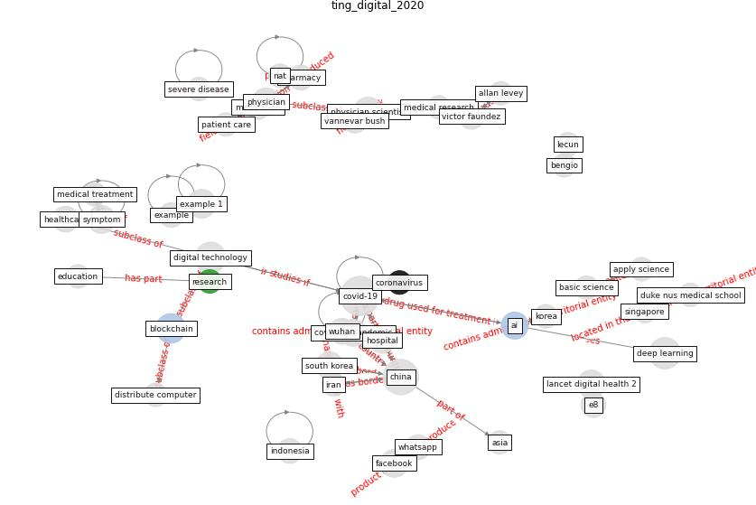

# Article: __Digital technology and COVID-19__ (ting_digital_2020)

* [10.1038/s41591-020-0824-5](https://doi.org/10.1038/s41591-020-0824-5)
* Cluster: [blockchain-ai](cluster_11)

## Keywords

* [covid-19](keyword_covid-19), [china](keyword_china), [deep learning](keyword_deep_learning), [digital technology](keyword_digital_technology), [physician scientist](keyword_physician_scientist), [blockchain](keyword_blockchain), [physician](keyword_physician), [facebook](keyword_facebook), [lancet digital health 2](keyword_lancet_digital_health_2), [artificial intelligence](keyword_artificial_intelligence), [covid 19 pandemic](keyword_covid_19_pandemic), [south korea](keyword_south_korea), [hospital](keyword_hospital), victor faundez, [healthcare](keyword_healthcare)

## Keywords at large

* [covid-19](keyword_covid-19), [china](keyword_china), [deep learning](keyword_deep_learning), [digital technology](keyword_digital_technology), [physician scientist](keyword_physician_scientist), [blockchain](keyword_blockchain), [example 1](keyword_example_1), [physician](keyword_physician), [lancet digital health 2](keyword_lancet_digital_health_2), [symptom](keyword_symptom)

## Concepts

 

### Closest articles 

* [Pandemic Analytics: How Countries are Leveraging Big Data Analytics and Artificial Intelligence to Fight COVID-19?](article_mehta_pandemic_2021)
* [Exploring the Potential of Artificial Intelligence and Machine Learning to Combat COVID-19 and Existing Opportunities for LMIC: A Scoping Review](article_naseem_exploring_2020)
* 
* [Towards the sustainable development of smart cities through mass video surveillance: A response to the COVID-19 pandemic](article_shorfuzzaman_towards_2021)
* [Coronavirus: Can artificial intelligence be smart enough
to detect fake news?](article_tong_coronavirus_2020)
* [Blockchain technology and its applications to combat COVID-19 pandemic](article_sharma_blockchain_2022)
* [The Smart City and Covid‐19](article_webb_smart_2020)
* [From Viral City to Smart City: Learning from Pandemic Experiences](article_sakellarides_viral_2020)
* [Amplifying the role of knowledge translation platforms in the COVID-19 pandemic response](article_el-jardali_amplifying_2020)
* [The three modes of existence of the pandemic smart city](article_soderstrom_three_2021)

