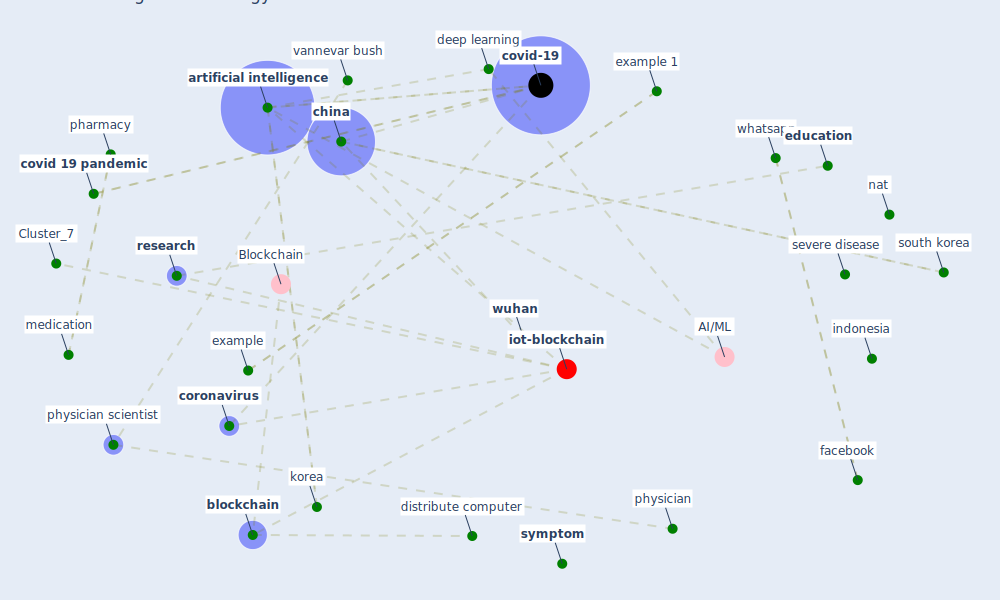

# Article: Digital technology and COVID-19 (ting_digital_2020)

* Source: [10.1038/s41591-020-0824-5](https://doi.org/10.1038/s41591-020-0824-5)
* Year: 2020
* Cluster: [datum-iot](cluster_4)

## Keywords

 * 2 duke university, 5e33fa3709f80b00113b6891, accurate tracking, ai algorithm, ai base, allan levey, apply research, apply science, [artificial intelligence](keyword_artificial_intelligence), asia, bali, basic research, basic science, bedside, bench, bengio, [big datum](keyword_big_datum), [blockchain](keyword_blockchain), chest imaging, [china](keyword_china), china 1, [chinese](keyword_chinese), compete interest, [coronavirus](keyword_coronavirus), covid 19 outbreak, [covid 19 pandemic](keyword_covid_19_pandemic), [covid-19](keyword_covid-19), dc, deep ai, [deep learning](keyword_deep_learning), [detection](keyword_detection), diagnosis, diagnostic, discovery, distribute computer, durham, dxy, [education](keyword_education), elective surgery, example, [example 1](keyword_example_1), extend beyond 6 month, [facebook](keyword_facebook), globalization, [healthcare](keyword_healthcare), [hospital](keyword_hospital), [hubei](keyword_hubei), iiot, [image](keyword_image), [indonesia](keyword_indonesia), instrument, intensive method, invention, iran, [knowledge](keyword_knowledge), [korea](keyword_korea), lecun, life science, [medical](keyword_medical), medication, medicine, middle east, model study, moderate disease, nat, nat al, [nature](keyword_nature), nc, new knowledge, patient care, pharmacy, physician, physician scientist, product, [public health](keyword_public_health), [research](keyword_research), rossman, science policy, scientist, screen test, segal, [service](keyword_service), severe disease, [south korea](keyword_south_korea), [symptom](keyword_symptom), t leung k leung g, t w, tencent, ting, trade, [usa](keyword_usa), vannevar bush, venkatesh narayanamurti, victor faundez, [washington](keyword_washington), whatsapp, worldometer, wu j m, [wuhan](keyword_wuhan), x ray

## Concepts

 

## Neighbours

### Closest articles

* Pandemic Analytics: How Countries are Leveraging Big Data Analytics and Artificial Intelligence to Fight COVID-19? - [LINK](article_mehta_pandemic_2021)
* A Comprehensive Review of the COVID-19 Pandemic and the Role of IoT, Drones, AI, Blockchain, and 5G in Managing its Impact - [LINK](article_chamola_comprehensive_2020)
* Exploring the Potential of Artificial Intelligence and Machine Learning to Combat COVID-19 and Existing Opportunities for LMIC: A Scoping Review - [LINK](article_naseem_exploring_2020)
* The role of 5G for digital healthcare against COVID-19 pandemic: Opportunities and challenges - [LINK](article_siriwardhana_role_2021)
* Leveraging Digital Transformation Technologies to Tackle COVID-19: Proposing a Privacy-First Holistic Framework - [LINK](article_arpaci_leveraging_2021)
* Mobile Technology Solution for COVID-19: Surveillance and Prevention - [LINK](article_raza_mobile_2021)
* Emerging Technologies to Combat the COVID-19 Pandemic - [LINK](article_vaishya_emerging_2020)
* Internet of things (IoT) applications to fight against COVID-19 pandemic - [LINK](article_singh_internet_2020)
* Health Information Exchange with Blockchain amid Covid-19-like Pandemics - [LINK](article_christodoulou_health_2020)
* Coronavirus: Can artificial intelligence be smart enough to detect fake news? - [LINK](article_tong_coronavirus_2020)

### Closest BPs

* Blueprint: Resilience in staffing and skills training - [LINK](bp_12)
* Blueprint: Air Cleaning Plants - [LINK](bp_15)
* Blueprint: Negative pressure rooms - [LINK](bp_13)
