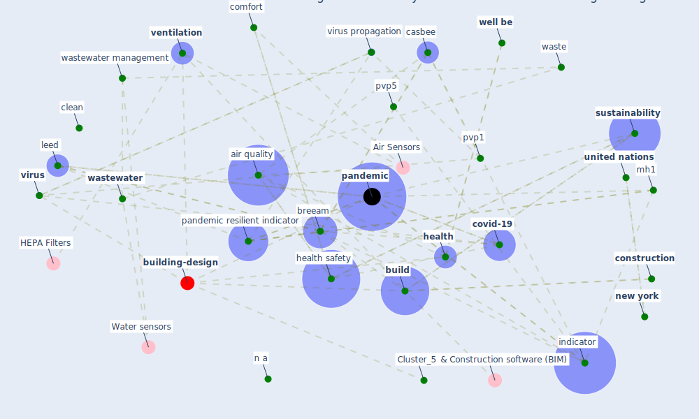

# Article: Readiness Assessment of Green Building Certification Systems for Residential Buildings during Pandemics (tleuken_readiness_2021)

* Source: [10.3390/su13020460](https://doi.org/10.3390/su13020460)
* Year: 2021
* Cluster: [building-energy](cluster_2)

## Keywords

 * acoustic, [air](keyword_air), [air conditioning](keyword_air_conditioning), air quality, appliance, aq3, aq4, [breeam](keyword_breeam), breeam standard, [build](keyword_build), [building](keyword_building), carey, casbee, [clean](keyword_clean), [comfort](keyword_comfort), [construction](keyword_construction), [coronavirus](keyword_coronavirus), [covid 19 pandemic](keyword_covid_19_pandemic), [covid-19](keyword_covid-19), credit, criterion, d alessandro, daylight, [design](keyword_design), disinfect, [disinfection](keyword_disinfection), drink water, eu1, fixture, food, gbcs, [gbcss](keyword_gbcss), guney, healing, [health](keyword_health), [health and safety](keyword_health_and_safety), health safety, household waste, [humidity](keyword_humidity), [indicator](keyword_indicator), [indoor air quality](keyword_indoor_air_quality), [infection](keyword_infection), [italy](keyword_italy), [kazakhstan](keyword_kazakhstan), [leed](keyword_leed), liu, mh1, mh3, mh4, n a, nazarbayev university, [new york](keyword_new_york), [noise](keyword_noise), [occupant](keyword_occupant), [pandemic](keyword_pandemic), pandemic resilience, pandemic resilient, [pandemic resilient indicator](keyword_pandemic_resilient_indicator), [pathogen](keyword_pathogen), pc1, pc2, pvp1, pvp2, pvp4, pvp5, quarantine, [recycle](keyword_recycle), renewable energy, [residential](keyword_residential), [russia](keyword_russia), [sanitation](keyword_sanitation), [sar cov 2](keyword_sar_cov_2), [social](keyword_social), sub criterion, [sustainability](keyword_sustainability), [switzerland](keyword_switzerland), [temperature](keyword_temperature), toxic compound, [united nations](keyword_united_nations), urban farming, [ventilation](keyword_ventilation), [virus](keyword_virus), virus propagation, waste, waste management, [wastewater](keyword_wastewater), wastewater management, water consumption, water quality, water quality and availability, wc, wc1, wc2, well, [well be](keyword_well_be), [window](keyword_window), wq1, wq2, wwm2, zhou

## Concepts

 

## Neighbours

### Closest articles

* Assessment method for new sustainability indicators providing pandemic resilience for residential buildings - [LINK](article_tokazhanov_assessment_2021)
* How to Make Green Building Certification &amp; Rating Systems More Pandemic-Sustainable? - [LINK](article_ujikawa_how_2022)
* COVID-19 and Green Housing: A Review of Relevant Literature - [LINK](article_kaklauskas_covid-19_2021)
* COVID-19 Experience Transforming the Protective Environment of Office Buildings and Spaces - [LINK](article_phapant_covid-19_2021)
* Towards Resilient Residential Buildings and Neighborhoods in Light of COVID-19 Pandemic—The Scenario of Podgorica, Montenegro - [LINK](article_bojovic_towards_2022)
* A study on office workplace modification during the COVID-19 pandemic in The Netherlands - [LINK](article_hou_study_2021)
* Mental health and COVID-19 - [LINK](article_who_mental_2021)
* It’s time to reimagine where and how work will get done (PwC’s US Remote Work Survey) - [LINK](article_pricewaterhousecoopers_its_2021)
* How our homes impact our health: using a COVID-19 informed approach to examine urban apartment housing - [LINK](article_peters_how_2020)
* Mental Health and the Covid-19 Pandemic - [LINK](article_pfefferbaum_mental_2020)

### Closest BPs

* Blueprint: Building Adaptation during a pandemic - [LINK](bp_14)
* Blueprint: Architecture design - [LINK](bp_2)
* Blueprint: nan - [LINK](bp_34)
