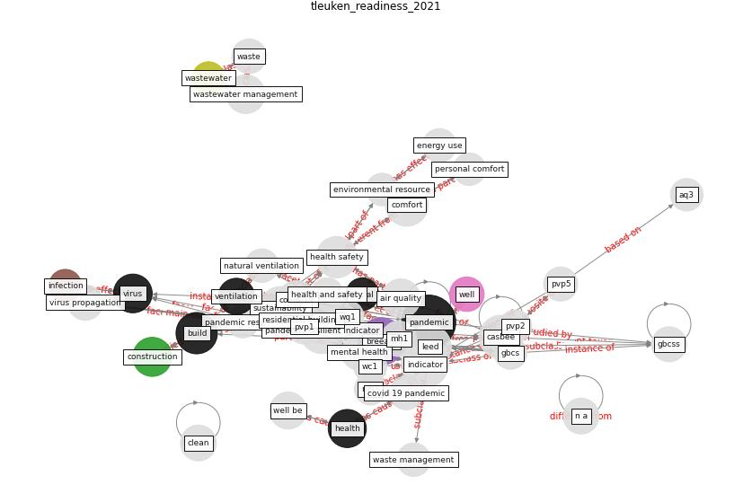

# Article: __Readiness Assessment of Green Building Certification Systems for Residential Buildings during Pandemics__ (tleuken_readiness_2021)

* [10.3390/su13020460](https://doi.org/10.3390/su13020460)
* Cluster: [building-space](cluster_7)

## Keywords

[pandemic](keyword_pandemic), [breeam](keyword_breeam), [build](keyword_build), [construction](keyword_construction), [virus](keyword_virus), [health](keyword_health)

## Abstract

One of the consequences of COVID-19 pandemic is the
momentum it has created for global changes affecting
various aspects of daily lives. Among these, green building
certification systems (GBCSs) should not be left behind as
significant potential modifications may be required to
ensure their versatility for residential buildings due to
the new pandemic reality. The present study aims to
evaluate the readiness of chosen GBCSs for a proper
assessment of existing residential housing sustainability
in a post-pandemic world. Based on a literature review of
the state-of-the-art data sources and round table
discussions, the present study proposes a particular set of
sustainability indicators covering special sustainability
requirements under pandemic conditions. Then, those
indicators are used to evaluate the readiness of selected
GBCSs (BREEAM, LEED, WELL, CASBEE) to meet new
pandemic-resilient requirements based on their responses to
the indicators. The assessment shows that none of the
reviewed GBCSs are fully ready to cover all the proposed
indicators. GBCSs have differing focuses on particular
sustainability pillars, which also affected their responses
to pandemic-resilient categories. For instance, WELL rating
system successfully responded to the health and safety
category, whereas LEED showed better preparedness in terms
of environmental efficiency. BREEAM and CASBEE systems have
a more evenly distributed attention to all three
pandemic-resilient categories (Health \& Safety,
Environmental Resources Consumption, and Comfort) with an
accent on the Comfort category. On a specific note, all
GBCSs are insufficiently prepared for waste and wastewater
management. In the future, GBCSs should be modified to
better adapt to pandemic conditions, for which the current
work may provide a basis. As an alternative, brand new
standards can be created to face newly arising and evolving
post-pandemic requirements.

## Concepts

 

### References 

* [COVID-19 Could Leverage a Sustainable Built
Environment](article_pinheiro_covid-19_2020)
* [A Mixed Approach on Resilience of Spanish
Dwellings and Households during COVID-19 Lockdown](article_cuerdo-vilches_mixed_2020)
* [How loneliness is talked about in social media during
COVID-19 pandemic: Text mining of 4,492 Twitter
feeds](article_koh_how_2022)
* [SARS-CoV-2 in wastewater: potential health risk, but
also data source](article_lodder_sars-cov-2_2020)
* [Antivirus-built environment: Lessons learned from
Covid-19 pandemic](article_megahed_antivirus-built_2020)
* [Effects of temperature and humidity on the spread of
COVID-19: A systematic review](article_mecenas_effects_2020)
* [First detection of SARS-CoV-2 in untreated wastewaters
in Italy](article_la_rosa_first_2020)

### Cited by 

* [Prophylactic Architecture: Formulating the Concept
of Pandemic-Resilient Homes](article_elrayies_prophylactic_2022)* [COVID-19 and Green Housing: A Review of
Relevant Literature](article_kaklauskas_covid-19_2021)* [Assessment method for new sustainability indicators
providing pandemic resilience for residential buildings](article_tokazhanov_assessment_2021)* [How to Make Green Building Certification \&
Rating Systems More Pandemic-Sustainable?](article_ujikawa_how_2022)
