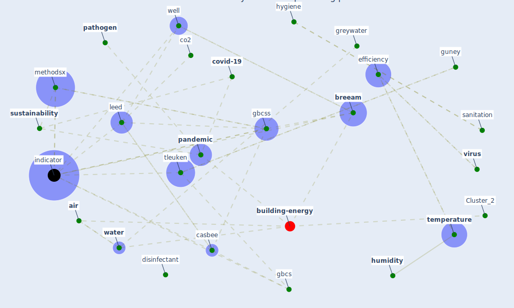

# Article: Assessment method for new sustainability indicators providing pandemic resilience for residential buildings (tokazhanov_assessment_2021)

* Source: [10.1016/j.mex.2021.101577](https://doi.org/10.1016/j.mex.2021.101577)
* Year: 2021
* Cluster: [building-design](cluster_5)

## Keywords

 * 1 point, 5 point scale, acoustic, add to, [air](keyword_air), air quality, [apartment](keyword_apartment), appliance, [architect](keyword_architect), [bacteria](keyword_bacteria), [balcony](keyword_balcony), [breeam](keyword_breeam), breeam indicator, [build](keyword_build), casbee, [clean](keyword_clean), co2, [coating](keyword_coating), comfort, [community](keyword_community), [coronavirus](keyword_coronavirus), [covid 19 pandemic](keyword_covid_19_pandemic), [covid-19](keyword_covid-19), criterion, day, [disinfectant](keyword_disinfectant), [disinfection](keyword_disinfection), drink water, elevator button, emergency, [energy](keyword_energy), [energy consumption](keyword_energy_consumption), energy supply, energy use, efficiency, farm, [garden](keyword_garden), [gardening](keyword_gardening), gbcs, [gbcss](keyword_gbcss), greywater, guney, hardship of, household waste, [humidity](keyword_humidity), hygiene, [indicator](keyword_indicator), [infection](keyword_infection), innovative technology, isolation, landscape, [leed](keyword_leed), [lockdown](keyword_lockdown), magazine, [management](keyword_management), [material](keyword_material), [method](keyword_method), methodology, methodsx, microclimate, night, noise insulation, ozone, [pandemic](keyword_pandemic), [pandemic resilient indicator](keyword_pandemic_resilient_indicator), [pathogen](keyword_pathogen), propagation, [sanitation](keyword_sanitation), seal, separate toilet, sink, [smart](keyword_smart), socialize, [spread](keyword_spread), [surface](keyword_surface), sustain, [sustainability](keyword_sustainability), [sustainable](keyword_sustainable), [system](keyword_system), tap water, [technology](keyword_technology), [temperature](keyword_temperature), the wake of, [tleuken](keyword_tleuken), [toilet](keyword_toilet), [transmission](keyword_transmission), [transportation](keyword_transportation), [urban](keyword_urban), [ventilation](keyword_ventilation), ventilation system, [virus](keyword_virus), virus propagation, waste, waste management, [wastewater](keyword_wastewater), [water](keyword_water), water quality, [well](keyword_well), [work](keyword_work), filter

## Concepts

 

## Neighbours

### Closest articles

* Readiness Assessment of Green Building Certification Systems for Residential Buildings during Pandemics - [LINK](article_tleuken_readiness_2021)
* How to Make Green Building Certification &amp; Rating Systems More Pandemic-Sustainable? - [LINK](article_ujikawa_how_2022)
* When the fourth water and digital revolution encountered COVID-19 - [LINK](article_poch_when_2020)
* Future perspectives of wastewater-based epidemiology: Monitoring infectious disease spread and resistance to the community level - [LINK](article_sims_future_2020)
* Strengthening resilience: a priority shared by Health 2020 and - [LINK](article_who_strengthening_2017)
* China adapts survey drones to enforce world’s largest quarantine - [LINK](article_liu_china_2020)
* COVID-19 as a Harbinger of Transforming Infrastructure Resilience - [LINK](article_carvalhaes_covid-19_2020)
* Computational analysis of SARS-CoV-2/COVID-19 surveillance by wastewater-based epidemiology locally and globally: Feasibility, economy, opportunities and challenges - [LINK](article_hart_computational_2020)

### Closest BPs

* Blueprint: Monitoring of wastewater - [LINK](bp_21)
* Blueprint: Indoor Environmental Quality (IEQ) monitoring system - [LINK](bp_3)
* Blueprint: Air Cleaning Plants - [LINK](bp_15)
