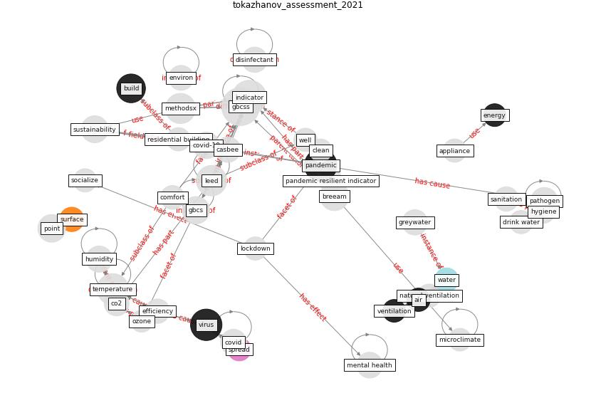

# Article: Assessment method for new sustainability indicators providing pandemic resilience for residential buildings (tokazhanov_assessment_2021)

* Source: [10.1016/j.mex.2021.101577](https://doi.org/10.1016/j.mex.2021.101577)
* Year: 2021
* Cluster: [building-space](cluster_1)

## Keywords

 * 1 point, 5 point scale, acoustic, [air](keyword_air), air quality, [apartment](keyword_apartment), appliance, [architect](keyword_architect), [bacteria](keyword_bacteria), [balcony](keyword_balcony), [breeam](keyword_breeam), breeam indicator, [build](keyword_build), casbee, city specific, [clean](keyword_clean), co2, comfort, [community](keyword_community), [coronavirus](keyword_coronavirus), [covid 19 pandemic](keyword_covid_19_pandemic), [covid-19](keyword_covid-19), criterion, day, [disinfectant](keyword_disinfectant), [disinfection](keyword_disinfection), drink water, emergency, [energy](keyword_energy), [energy consumption](keyword_energy_consumption), energy reduction ratio, energy supply, [energy use](keyword_energy_use), exercise, efficiency, farm, [garden](keyword_garden), [gardening](keyword_gardening), gbcs, [gbcss](keyword_gbcss), greywater, guney, hardship of, [humidity](keyword_humidity), hygiene, [indicator](keyword_indicator), [infection](keyword_infection), [landscape](keyword_landscape), [leed](keyword_leed), [lockdown](keyword_lockdown), magazine, management, material, medical waste, [mental health](keyword_mental_health), mental state, methodology, methodsx, microclimate, natural ventilation, night, noise insulation, ozone, [pandemic](keyword_pandemic), [pandemic resilient indicator](keyword_pandemic_resilient_indicator), [pathogen](keyword_pathogen), physical activity, pipe, [point](keyword_point), propagation, quarantine, residential building, sanitation, [smart](keyword_smart), socialize, [spread](keyword_spread), [surface](keyword_surface), sustain, [sustainability](keyword_sustainability), [sustainable](keyword_sustainable), [system](keyword_system), tap water, [technology](keyword_technology), [temperature](keyword_temperature), the wake of, [tleuken](keyword_tleuken), [toilet](keyword_toilet), [transmission](keyword_transmission), [urban](keyword_urban), [ventilation](keyword_ventilation), [virus](keyword_virus), virus propagation, waste, waste management, [wastewater](keyword_wastewater), [water](keyword_water), water quality, [well](keyword_well), [work](keyword_work), filter

## Concepts

 

## Neighbours

### Closest articles

* Readiness Assessment of Green Building Certification Systems for Residential Buildings during Pandemics - [LINK](article_tleuken_readiness_2021)
* How to Make Green Building Certification &amp; Rating Systems More Pandemic-Sustainable? - [LINK](article_ujikawa_how_2022)
* COVID-19 Bulletin 1: Alterations to BREEAM assessment requirements as a result of the Coronavirus pandemic – Knowledge Base - [LINK](article_breeam_covid-19_2020)
* Refleksioner fra en pandemi - [LINK](article_realdania_refleksioner_2022)
* Pandemiens arkitektur - [LINK](article_realdania_pandemiens_2022)
* An investigation of transmission control measures during the first 50 days of the COVID-19 epidemic in China - [LINK](article_tian_investigation_2020)
* The effect of human mobility and control measures on the COVID-19 epidemic in China - [LINK](article_kraemer_effect_2020)
* Mitigation strategies and compliance in the COVID-19 fight; how much compliance is enough? - [LINK](article_mukerjee_mitigation_2021)
* The Intelligent Lockdown: Compliance with COVID-19 Mitigation Measures in the Netherlands - [LINK](article_kuiper_intelligent_2020)
* Compliance with COVID-19 Mitigation Measures in the United States - [LINK](article_van_rooij_compliance_2020)

### Closest BPs

* Blueprint: One-way mobility circulation - [LINK](bp_4)
* Blueprint: Smart Locker System - [LINK](bp_1)
* Blueprint: Access limitation - [LINK](bp_7)
