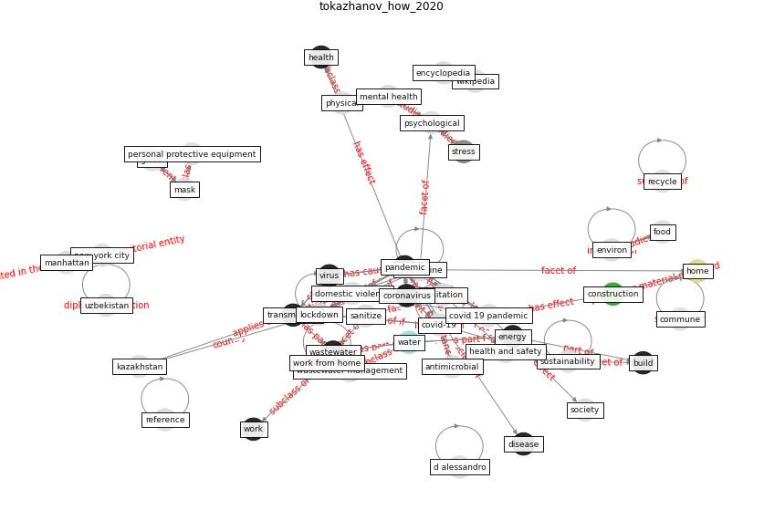

# Article: __How is COVID-19 Experience Transforming Sustainability Requirements of Residential Buildings? A Review__ (tokazhanov_how_2020)

* [10.3390/su12208732](https://doi.org/10.3390/su12208732)
* Cluster: [building-green](cluster_15)

## Keywords

[pandemic](keyword_pandemic), [coronavirus](keyword_coronavirus), [wastewater](keyword_wastewater), [virus](keyword_virus), [water](keyword_water), [sustainability](keyword_sustainability)

## Abstract

The COVID-19 pandemic is bringing about changes, and
alongside these, we can alter the way we design our living
spaces. The need for a healthy and comfortable living space
is essential to mental and physical well-being. The present
study covers the most up-to-date documents, including
peer-reviewed papers, blog posts, news, journal articles,
and expert opinions, to critically review lessons learned
from the COVID-19 pandemic and evaluates the expected
changes in sustainability requirements of residential
buildings. Health and safety, environment, and comfort are
the three main aspects of residential buildings that have
been tested during quarantines and are also expected to
experience major transformations toward sustainability.
Residential houses should provide certain health and safety
protective measures to their occupants, such as the
application of new touchless technologies, having proper
sanitation to diminish the probability of getting infected,
and developing greener and more intimate spaces that can
help recover and improve mental states. Our findings
address the need to reconsider sustainability requirements
for residential buildings, which will provide adequate
health and safety and comfort with no significant harm to
the environment.

## Concepts

 

### References 

* [2019 Novel Coronavirus (COVID-19) Pandemic:
Built Environment Considerations To Reduce
Transmission](article_dietz_2019_2020)
* [Antivirus-built environment: Lessons learned from
Covid-19 pandemic](article_megahed_antivirus-built_2020)
* [The socio-economic implications of the coronavirus
pandemic (COVID-19): A review](article_nicola_socio-economic_2020)
* [COVID-19 and Living space challenge. Well-being and
Public Health recommendations for a healthy, safe, and
sustainable housing.](article_dalessandro_covid-19_2020)
* [COVID-19 Could Leverage a Sustainable Built
Environment](article_pinheiro_covid-19_2020)
* [SARS-CoV-2 RNA detection of hospital isolation wards
hygiene monitoring during the Coronavirus Disease 2019
outbreak in a Chinese hospital](article_wang_sars-cov-2_2020)
* [SARS-CoV-2 in wastewater: potential health risk, but
also data source](article_lodder_sars-cov-2_2020)
* [Pandemic stricken cities on lockdown. Where are our
planning and design professionals [now, then and into the
future]?](article_allam_pandemic_2020)
* [Aerosol and Surface Stability of SARS-CoV-2 as
Compared with SARS-CoV-1](article_van_doremalen_aerosol_2020)

### Cited by 

* [A Review on Building Design as a Biomedical
System for Preventing COVID-19 Pandemic](article_amran_review_2022)
* [Towards Resilient Residential Buildings and
Neighborhoods in Light of COVID-19 Pandemic—The
Scenario of Podgorica, Montenegro](article_bojovic_towards_2022)
* [Prophylactic Architecture: Formulating the Concept
of Pandemic-Resilient Homes](article_elrayies_prophylactic_2022)
* [COVID-19 and Green Housing: A Review of
Relevant Literature](article_kaklauskas_covid-19_2021)
* [Designing Post COVID-19 Buildings: Approaches for
Achieving Healthy Buildings](article_navaratnam_designing_2022)
* [COVID-19 Experience Transforming the Protective
Environment of Office Buildings and Spaces](article_phapant_covid-19_2021)
* [Readiness Assessment of Green Building
Certification Systems for Residential Buildings
during Pandemics](article_tleuken_readiness_2021)
* [Assessment method for new sustainability indicators
providing pandemic resilience for residential buildings](article_tokazhanov_assessment_2021)
