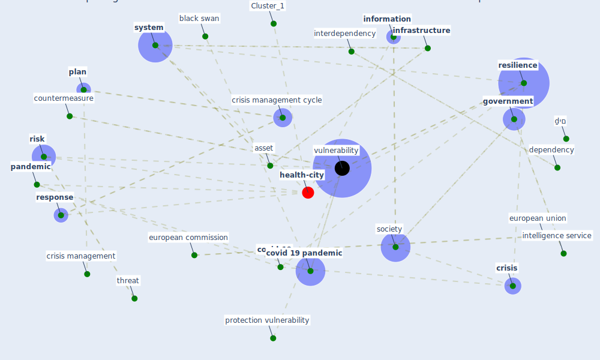

# Article: Preparing critical infrastructure for the future: Lessons learnt from the Covid-19 pandemic (tomalska_preparing_2022)

* Source: [10.35467/sdq/146603](https://doi.org/10.35467/sdq/146603)
* Year: 2022
* Cluster: [health-city](cluster_1)

## Keywords

 * asset, bassett g, birkmann j, black swan, buehre w, buildingãâãâresilience, [china](keyword_china), cognitive, communication, complexity, countermeasure, [country](keyword_country), couple, [covid 19 pandemic](keyword_covid_19_pandemic), [covid-19](keyword_covid-19), [crisis](keyword_crisis), crisis management, crisis management cycle, criticalinfrastructure, cybercrime, decision make, department of homeland security, [dependency](keyword_dependency), detect the possible threat, directive, disinformation, earthquake spectra, european commission, european parliament, [european union](keyword_european_union), evolve, fairfax, [fake news](keyword_fake_news), fekete a, first phase, first wave, fortification, geneva, george mason university, [government](keyword_government), hague, [health system](keyword_health_system), [healthcare](keyword_healthcare), [healthcare system](keyword_healthcare_system), highly interconnect system, impact assessment, [information](keyword_information), [infrastructure](keyword_infrastructure), intelligence service, [interdependency](keyword_interdependency), interpol, israel, it hardware, its consequence, low case, lyon, manage risk, medium, [member state](keyword_member_state), memberstate, [misinformation](keyword_misinformation), [mitigation](keyword_mitigation), monterey, nis 2 directive, nis directive, operator, [pandemic](keyword_pandemic), [plan](keyword_plan), [poland](keyword_poland), preparedness, [pressure](keyword_pressure), preventive, protection vulnerability, [public health](keyword_public_health), [recovery](keyword_recovery), [resilience](keyword_resilience), resilient, [response](keyword_response), [risk](keyword_risk), risk management, robustness, security culture, [society](keyword_society), [supply chain](keyword_supply_chain), supply risk, [system](keyword_system), system safety, the pandemic, threat, [training](keyword_training), [transportation](keyword_transportation), turnaround stage, uncertainty, university of warsaw, unpredictability of the future, [vulnerability](keyword_vulnerability), warsaw, [washington dc](keyword_washington_dc), what might occur in the future, ḏים

## Concepts

 

## Neighbours

### Closest articles

* COVID-19 as a Harbinger of Transforming Infrastructure Resilience - [LINK](article_carvalhaes_covid-19_2020)
* COVID-19 and a new resilient infrastructure landscape - [LINK](article_oecd_covid-19_2021)
* Guidelines for resilience systems analysis - [LINK](article_oecd_guidelines_2014)
* A review of definitions and measures of system resilience - [LINK](article_hosseini_review_2016)
* Strengthening resilience: a priority shared by Health 2020 and - [LINK](article_who_strengthening_2017)
* China adapts survey drones to enforce world’s largest quarantine - [LINK](article_liu_china_2020)
* Assessment method for new sustainability indicators providing pandemic resilience for residential buildings - [LINK](article_tokazhanov_assessment_2021)
* Readiness Assessment of Green Building Certification Systems for Residential Buildings during Pandemics - [LINK](article_tleuken_readiness_2021)
* How to Make Green Building Certification &amp; Rating Systems More Pandemic-Sustainable? - [LINK](article_ujikawa_how_2022)

### Closest BPs

* Blueprint: Monitoring of wastewater - [LINK](bp_21)
* Blueprint: Indoor Environmental Quality (IEQ) monitoring system - [LINK](bp_3)
* Blueprint: Air Cleaning Plants - [LINK](bp_15)
