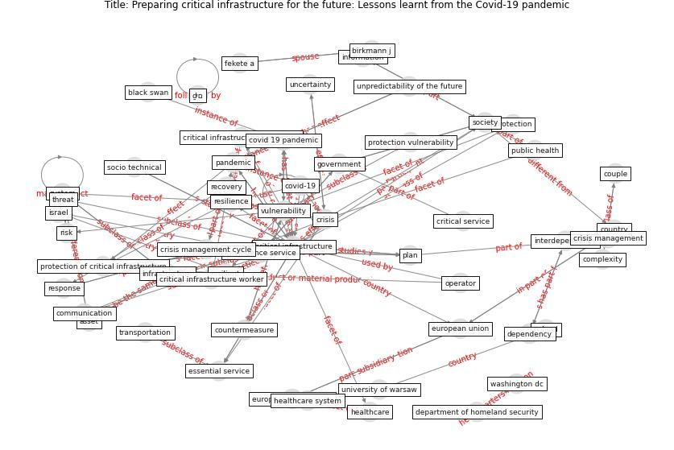

# Article: Preparing critical infrastructure for the future: Lessons learnt from the Covid-19 pandemic (tomalska_preparing_2022)

* Source: [10.35467/sdq/146603](https://doi.org/10.35467/sdq/146603)
* Year: 2022
* Cluster: [health-pandemic](cluster_4)

## Keywords

 * argonne national laboratory, [asset](keyword_asset), bassett g, birkmann j, black swan, buehre w, [china](keyword_china), cognitive, communication, complexity, countermeasure, [country](keyword_country), couple, [covid 19 pandemic](keyword_covid_19_pandemic), [covid-19](keyword_covid-19), [crisis](keyword_crisis), crisis management, crisis management cycle, [critical infrastructure](keyword_critical_infrastructure), critical infrastructure protection, critical infrastructure worker, critical service, critical vital function, criticalinfrastructure, cybercrime, decision make, department of homeland security, dependency, detect the possible threat, directive, disinformation, distribution, earthquake spectra, essential service, essential service function, essential staff, european commission, european parliament, [european union](keyword_european_union), evolve, fairfax, fekete a, fortification, george mason university, [government](keyword_government), [health system](keyword_health_system), [healthcare](keyword_healthcare), healthcare system, impact assessment, information, [infrastructure](keyword_infrastructure), intelligence service, interdependency, international journal of operation and productionmanagement, interpol, israel, low case, lyon, manage risk, medium, [member state](keyword_member_state), [misinformation](keyword_misinformation), new normal, nis 2 directive, nis directive, operator, [pandemic](keyword_pandemic), [plan](keyword_plan), [poland](keyword_poland), preparedness, presidential policy directive, preventive, protection, protection of critical infrastructure, protection vulnerability, [public health](keyword_public_health), [recovery](keyword_recovery), [resilience](keyword_resilience), resilient, response, [risk](keyword_risk), robustness, [society](keyword_society), socio technical, [supply chain](keyword_supply_chain), [system](keyword_system), system safety, the pandemic, threat, transportation, travel restriction, turnaround stage, uncertainty, university of warsaw, unpredictability of the future, [vulnerability](keyword_vulnerability), warsaw, [washington dc](keyword_washington_dc), what might occur in the future, ḏים

## Concepts

 

## Neighbours

### Closest articles

* COVID-19 as a Harbinger of Transforming Infrastructure Resilience - [LINK](article_carvalhaes_covid-19_2020)
* COVID-19 and a new resilient infrastructure landscape - [LINK](article_oecd_covid-19_2021)
* DfMA for rapid adaptive resilience and flexible infrastructure - [LINK](article_mott_macdonald_dfma_2020)
* Guidelines for resilience systems analysis - [LINK](article_oecd_guidelines_2014)
* A review of definitions and measures of system resilience - [LINK](article_hosseini_review_2016)
* Strengthening resilience: a priority shared by Health 2020 and - [LINK](article_who_strengthening_2017)
* The contribution of green buildings in the fight against COVID-19 - [LINK](article_world_green_building_council_contribution_2020)
*  - [LINK](article_yakubu_aminu_dodo_green_2020)
* Overcoming the Impact of COVID-19 Using Integrated Project Delivery Model - [LINK](article_g_overcoming_2020)
* Validity of energy social research during and after COVID-19: challenges, considerations, and responses - [LINK](article_fell_validity_2020)

### Closest BPs

* Blueprint: Architecture design - [LINK](bp_2)
* Blueprint: Building Adaptation during a pandemic - [LINK](bp_14)
* Blueprint: Indoor Environmental Quality (IEQ) monitoring system - [LINK](bp_3)
