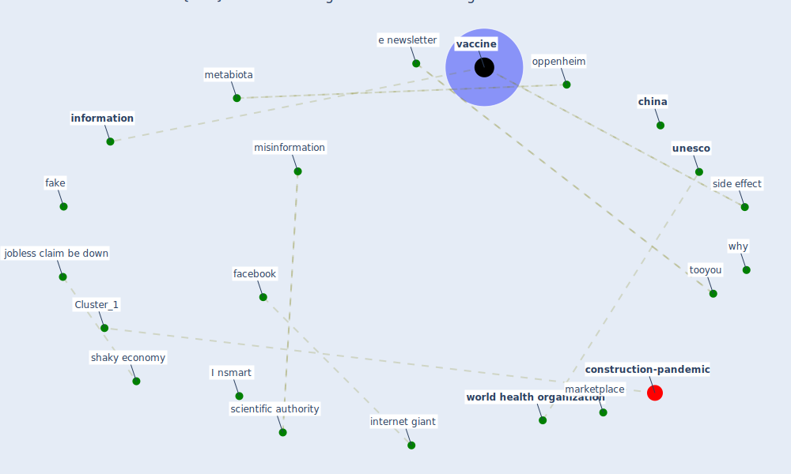

# Article: Coronavirus: Can artificial intelligence be smart enough to detect fake news? (tong_coronavirus_2020)

* [https://www.marketplace.org/2020/02/12/coronavirus-can-artificial-intelligence-be-smart-enough-to-detect-fake-news/](https://www.marketplace.org/2020/02/12/coronavirus-can-artificial-intelligence-be-smart-enough-to-detect-fake-news/)
* Year: 2020
* Cluster: [construction-pandemic](cluster_1)

## Keywords

 * 501 c 3, I nsmart, I o nnew, ad word, american, american city, andrew le, [artificial intelligence](keyword_artificial_intelligence), bat video, bleach, [business](keyword_business), censor, censorship, ceo, [china](keyword_china), content play, content play spread work, cornell, cornell university, [coronavirus](keyword_coronavirus), coronavirus can be cure with ultraviolet lamp, coronavirus can be cure with ultraviolet lamp or sesame oil, counterargument, coverage, d e s f r o m o u r s h, deceptive, [digital](keyword_digital), disinformation, drink bleach, dryer, e newsletter, [economic](keyword_economic), edisease, [education](keyword_education), email, expert, [facebook](keyword_facebook), fact base, fact checker, fake, [fake news](keyword_fake_news), flu, free speech, hand dryer, health datum science, health organization, [human](keyword_human), income drive repayment plan, independent journalism, influencer, [information](keyword_information), insurance, [internet](keyword_internet), internet giant, jobless claim be down, legitimate, limit, m o u r s h, [marketplace](keyword_marketplace), message, messenger, [metabiota](keyword_metabiota), [misinformation](keyword_misinformation), mpr, [news](keyword_news), novel, oppenheim, pacific island, palau, [prevention](keyword_prevention), [privacy policy](keyword_privacy_policy), problem, [public health](keyword_public_health), [robot](keyword_robot), sarah krep, scientific authority, [shaky economy](keyword_shaky_economy), side effect, [smart](keyword_smart), student loan, [symptom](keyword_symptom), symptom do you have, take down, tatfake, term of use, the cdc, the coronavirus, tiktok, tooyou, turn out to be true, [unesco](keyword_unesco), [vaccine](keyword_vaccine), vaccine race update, [video](keyword_video), [viral](keyword_viral), [virus](keyword_virus), virus break, why, [world health organization](keyword_world_health_organization), [world heritage site](keyword_world_heritage_site)

## Concepts

 

## Neighbours

### Closest articles

* COVID-19 misinformation: Accuracy of articles about coronavirus prevention mostly shared on social media - [LINK](article_obiala_covid-19_2021)
* Infodemic and the spread of fake news in the COVID-19-era - [LINK](article_orso_infodemic_2020)
* What drives unverified information sharing and cyberchondria during the COVID-19 pandemic? - [LINK](article_laato_what_2020)
* The changes in the effects of social media use of Cypriots due to COVID-19 pandemic - [LINK](article_kaya_changes_2020)
* COVID-19 media fatigue: predictors of decreasing interest and avoidance of COVID-19–related news - [LINK](article_buneviciene_covid-19_2021)
* Telehealth overpromises during the Covid-19 pandemic - [LINK](article_ostherr_telehealth_2020)
* Pandemic Analytics: How Countries are Leveraging Big Data Analytics and Artificial Intelligence to Fight COVID-19? - [LINK](article_mehta_pandemic_2021)
* Exploring the Potential of Artificial Intelligence and Machine Learning to Combat COVID-19 and Existing Opportunities for LMIC: A Scoping Review - [LINK](article_naseem_exploring_2020)
* Digital technology and COVID-19 - [LINK](article_ting_digital_2020)
* Mobile Technology Solution for COVID-19: Surveillance and Prevention - [LINK](article_raza_mobile_2021)

### Closest BPs

* Blueprint: Resilience in staffing and skills training - [LINK](bp_12)
* Blueprint: Negative pressure rooms - [LINK](bp_13)
* Blueprint: Air Cleaning Plants - [LINK](bp_15)
