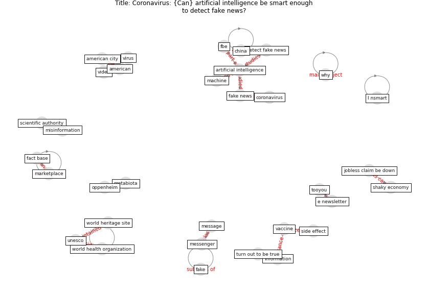

# Article: __Coronavirus: Can artificial intelligence be smart enough to detect fake news?__ (tong_coronavirus_2020)

* URL: [https://www.marketplace.org/2020/02/12/coronavirus-can-artificial-intelligence-be-smart-enough-to-detect-fake-news/](https://www.marketplace.org/2020/02/12/coronavirus-can-artificial-intelligence-be-smart-enough-to-detect-fake-news/)
* Year: 2020
* Abstract: Misinformation has been spreading online, in some places
seemingly faster than the disease itself.

## Keywords

* [artificial intelligence](keyword_artificial_intelligence), [fake news](keyword_fake_news), [detect fake news](keyword_detect_fake_news), [marketplace](keyword_marketplace), [coronavirus](keyword_coronavirus), [vaccine](keyword_vaccine), [metabiota](keyword_metabiota), [china](keyword_china), [information](keyword_information), [shaky economy](keyword_shaky_economy), internet giant, jobless claim be down, [world health organization](keyword_world_health_organization), [human](keyword_human), free speech

## Keywords at large

* [artificial intelligence](keyword_artificial_intelligence), [fake news](keyword_fake_news), [detect fake news](keyword_detect_fake_news), [marketplace](keyword_marketplace), [coronavirus](keyword_coronavirus), [vaccine](keyword_vaccine), [metabiota](keyword_metabiota), [china](keyword_china), [information](keyword_information), [shaky economy](keyword_shaky_economy)

## Concepts

 

### Closest articles 

* [COVID-19 misinformation: Accuracy of articles about coronavirus prevention mostly shared on social media](article_obiala_covid-19_2021)
* [What drives unverified information sharing and cyberchondria during the COVID-19 pandemic?](article_laato_what_2020)
* [The changes in the effects of social media use of Cypriots due to COVID-19 pandemic](article_kaya_changes_2020)
* [Blockchain technology and its applications to combat COVID-19 pandemic](article_sharma_blockchain_2022)
* [COVID-19 media fatigue: predictors of decreasing interest and avoidance of COVID-19–related news](article_buneviciene_covid-19_2021)
* 
* [The impacts of knowledge, risk perception, emotion and information on citizens’ protective behaviors during the outbreak of COVID-19: a cross-sectional study in China](article_ning_impacts_2020)
* [COVID-19 Higher Mortality in Chinese Regions With Chronic Exposure to Lower Air Quality](article_pansini_covid-19_2021)
* [Digital technology and COVID-19](article_ting_digital_2020)
* [Air pollution linked with higher COVID-19 death rates](article_harvard_th_chan_schoold_of_public_health_air_2020)

