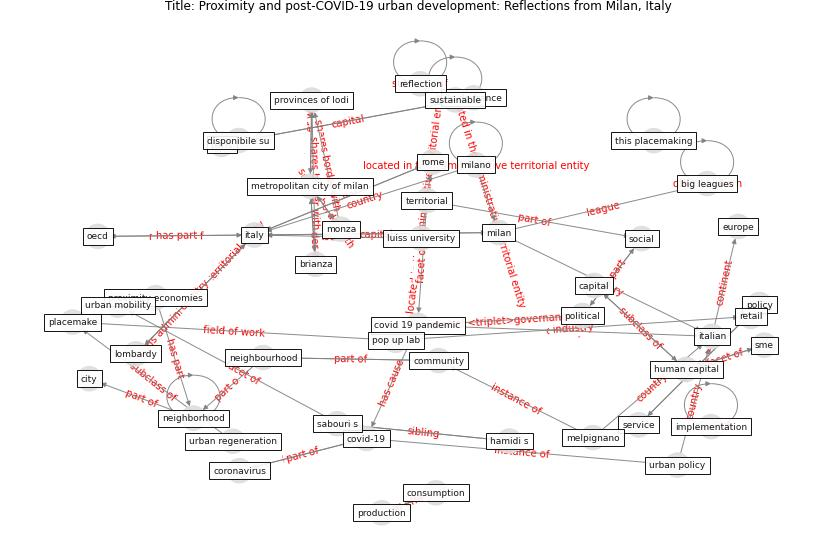

# Article: Proximity and post-COVID-19 urban development: Reflections from Milan, Italy (tricarico_proximity_2021)

* Source: [10.1016/j.jum.2021.03.005](https://doi.org/10.1016/j.jum.2021.03.005)
* Year: 2021
* Cluster: [city-health](cluster_14)

## Keywords

 * airbnb, anselmi g, badloan, bancaエtica, big leagues, brianza, broto v, [business](keyword_business), capital, [city](keyword_city), [community](keyword_community), consumer, consumption, contesto italiano, contini, coopfond, [coronavirus](keyword_coronavirus), corriere della sera, [covid 19 pandemic](keyword_covid_19_pandemic), [covid-19](keyword_covid-19), cugnata, culture, cura italia decree, decreto rilancio, deloitte, depreciation, dinamiche co evolutive di prossimit a, disponibile, disponibile su, dodds k, e commerce, economic measure, economicstructure, [economy](keyword_economy), [energy](keyword_energy), [europe](keyword_europe), fab city, faraoni, faraoni et, faraoni n, ferraresi t, hamidi s, human capital, ict, ile de france, implementation, [innovation](keyword_innovation), italian, [italy](keyword_italy), la pandemia della mobilita, lodi, lombardy, luca m, luiss university, melpignano, metropolitan city of milan, [milan](keyword_milan), milano, milena gabanelli, monni s, monza, monza brianza, nahiduzzaman, [neighborhood](keyword_neighborhood), neighbourhood, [oecd](keyword_oecd), paese, pandemia della mobilita, [pandemic](keyword_pandemic), paris, placemake, [policy](keyword_policy), political, pop up lab, production, [province](keyword_province), provinces of lodi, proximity, proximity economies, quarta rivoluzione industriale, retail, reflection, [rome](keyword_rome), roof, sabouri s, sei sfide per ripartire, service, [sme](keyword_sme), [social](keyword_social), socio economic, [sustainable](keyword_sustainable), territorial, this placemaking, urbact ii, [urban](keyword_urban), urban mobility, urban policy, urban recovery, urban regeneration, vicari s

## Concepts

 

## Neighbours

### Closest articles

* Urban planning after COVID-19 - [LINK](article_rtpi_urban_2021)
* COVID-19: Lessons for an Urban(izing) World - [LINK](article_acuto_covid-19_2020)
* Pandemic stricken cities on lockdown. Where are our planning and design professionals [now, then and into the future]? - [LINK](article_allam_pandemic_2020)
* Epidemics, Planning and the City: A Special Issue of Planning Perspectives - [LINK](article_davis_epidemics_2022)
* Coronavirus questions that will not go away: interrogating urban and socio-spatial implications of COVID-19 measures - [LINK](article_salama_coronavirus_2020)
* On the Coronavirus (COVID-19) Outbreak and the Smart City Network: Universal Data Sharing Standards Coupled with Artificial Intelligence (AI) to Benefit Urban Health Monitoring and Management - [LINK](article_allam_coronavirus_2020)
* Respiratory pandemics, urban planning and design: A multidisciplinary rapid review of the literature - [LINK](article_harris_respiratory_2022)
* COVID-19 Pandemic: Rethinking Strategies for Resilient Urban Design, Perceptions, and Planning - [LINK](article_afrin_covid-19_2021)
* The COVID-19 pandemic: Impacts on cities and major lessons for urban planning, design, and management - [LINK](article_sharifi_covid-19_2020)

### Closest BPs

* Blueprint: Architecture design - [LINK](bp_2)
* Blueprint: Building Adaptation during a pandemic - [LINK](bp_14)
* Blueprint: Tender support at building stage - [LINK](bp_9)
