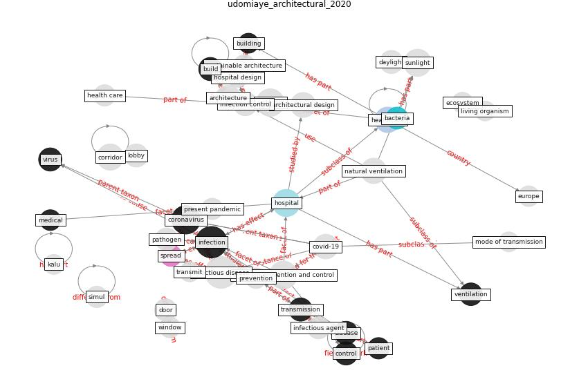

# Article: __Architectural design strategies for infection prevention and control (IPC) in health-care facilities: towards curbing the spread of Covid-19 \textbar SpringerLink__ (udomiaye_architectural_2020)

* URL: [https://link.springer.com/article/10.1007/s40201-020-00580-y](https://link.springer.com/article/10.1007/s40201-020-00580-y)
* Year: 2020

## Keywords

[infection](keyword_infection), [coronavirus](keyword_coronavirus), [hospital](keyword_hospital), [healthcare](keyword_healthcare), [design](keyword_design)

## Concepts

 

