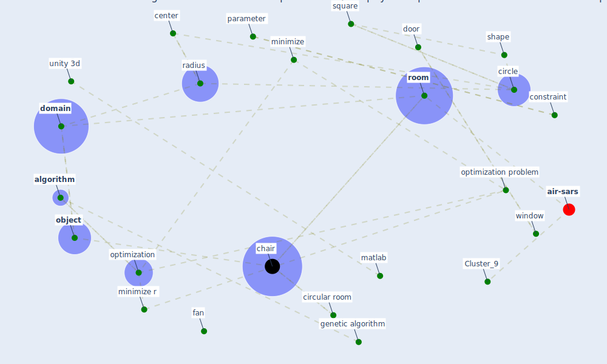

# Article: Social distancing enhanced automated optimal design of physical spaces in the wake of the COVID-19 pandemic (ugail_social_2021)

* Source: [10.1016/j.scs.2021.102791](https://doi.org/10.1016/j.scs.2021.102791)
* Year: 2021
* Cluster: [building-design](cluster_5)

## Keywords

 * 2r, 3l, air conditioner, airflow, airflow pattern, airplane, [algorithm](keyword_algorithm), [architecture](keyword_architecture), arrangement, atrium, bidarra, birgin, center, [chair](keyword_chair), [circle](keyword_circle), circle packing, circle packing problem, circular room, [city](keyword_city), communication, [computer](keyword_computer), [constraint](keyword_constraint), covid 19 disease, [covid 19 pandemic](keyword_covid_19_pandemic), [covid-19](keyword_covid-19), csv, decision maker, [design](keyword_design), [domain](keyword_domain), [door](keyword_door), [engineering](keyword_engineering), entity, equality, facility layout, fan, feasible solution, fischetti m, function, genetic algorithm, george j, gupta, heuristic, [industry](keyword_industry), [infection](keyword_infection), [infectious disease](keyword_infectious_disease), interior point algorithm, j hu m ku m, kraków, layer, leningrad, [manufacture](keyword_manufacture), martinez, matlab, [method](keyword_method), minimize, minimize r, morale, nocedal, nonlinear, nonlinear programming, [object](keyword_object), optimization, optimization algorithm, [optimization problem](keyword_optimization_problem), panda, [pandemic](keyword_pandemic), [parameter](keyword_parameter), perfor mance problem, [poland](keyword_poland), [present](keyword_present), problem, radius, rearrange, rectangular, ronconi, [room](keyword_room), [russia](keyword_russia), schneider, seat, seat arrangement, section 5, section 6, shape, [simulation](keyword_simulation), [society](keyword_society), software, springer optimization, square, stoustrup j, sustainable city, sustainable city and society, trust region, turbine, unity 3d, university of oxford, [variable](keyword_variable), [viral](keyword_viral), walkway, [window](keyword_window), yj

## Concepts

 

## Neighbours

### Closest articles

* Assessment of COVID-19 precautionary measures in sports facilities: A case study on a health club in Saudi Arabia - [LINK](article_ibrahim_assessment_2022)
* EXPOSED: An occupant exposure model for confined spaces to retrofit crowd models during a pandemic - [LINK](article_ronchi_exposed_2020)
* Building occupancy estimation with people flow modeling in AnyLogic - [LINK](article_li_building_2016)
* Questioning the use of the balcony in apartments during the COVID-19 pandemic process - [LINK](article_aydin_questioning_2020)
* COVID-ABS: An agent-based model of COVID-19 epidemic to simulate health and economic effects of social distancing interventions - [LINK](article_silva_covid-abs_2020)
* How will COVID-19 change future building regulations? - [LINK](article_hmc_architects_how_2020)
* A Mixed Approach on Resilience of Spanish Dwellings and Households during COVID-19 Lockdown - [LINK](article_cuerdo-vilches_mixed_2020)
* Architectural Design Drives the Biogeography of Indoor Bacterial Communities - [LINK](article_kembel_architectural_2014)
* COVID-19 Lessons for a Resilient Built Environment: A Roadmap - [LINK](article_hull_covid-19_2020)
* Will a pandemic change building codes? - [LINK](article_rozgus_will_2020)

### Closest BPs

* Blueprint: Installing high-efficiency air filters - [LINK](bp_11)
* Blueprint: Air Cleaning Plants - [LINK](bp_15)
* Blueprint: Monitoring of wastewater - [LINK](bp_21)
