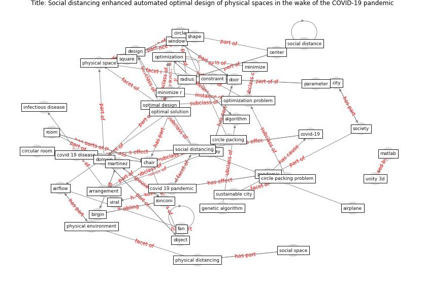

# Article: __Social distancing enhanced automated optimal design of physical spaces in the wake of the COVID-19 pandemic__ (ugail_social_2021)

* [10.1016/j.scs.2021.102791](https://doi.org/10.1016/j.scs.2021.102791)
* Cluster: [health-building](cluster_9)

## Keywords

* [algorithm](keyword_algorithm), [constraint](keyword_constraint), [physical space](keyword_physical_space), [optimal design](keyword_optimal_design), [circle](keyword_circle), [social distancing](keyword_social_distancing), [chair](keyword_chair), [covid 19 pandemic](keyword_covid_19_pandemic), [optimization problem](keyword_optimization_problem), [genetic algorithm](keyword_genetic_algorithm), [covid-19](keyword_covid-19), optimization, matlab, yuan, [door](keyword_door)

## Keywords at large

* [algorithm](keyword_algorithm), [constraint](keyword_constraint), [optimal design](keyword_optimal_design), [physical space](keyword_physical_space), [circle](keyword_circle), [social distancing](keyword_social_distancing), [chair](keyword_chair), [covid 19 pandemic](keyword_covid_19_pandemic), [optimization problem](keyword_optimization_problem), [genetic algorithm](keyword_genetic_algorithm)

## Concepts

 

### Closest articles 

* [COVID19-Routes: A Safe Pedestrian Navigation Service](article_cantarero_covid19-routes_2021)
* [Assessment of COVID-19 precautionary measures in sports facilities: A case study on a health club in Saudi Arabia](article_ibrahim_assessment_2022)
* [Exploring the Non-Medical impacts of Covid-19 using Natural Language Processing](article_agade_exploring_2020)
* [Building occupancy estimation with people flow modeling in AnyLogic](article_li_building_2016)
* [COVID-ABS: An agent-based model of COVID-19 epidemic to simulate health and economic effects of social distancing interventions](article_silva_covid-abs_2020)
* [Digital Twin of COVID-19 Mass Vaccination Centers](article_pilati_digital_2021)
* [EXPOSED: An occupant exposure model for confined spaces to retrofit crowd models during a pandemic](article_ronchi_exposed_2020)
* [How Covid-19 Has Permanently Changed the Fitness
Industry](article_davalos_how_2021)
* [How will COVID-19 change future building regulations?](article_hmc_architects_how_2020)
* [A Platform for Citizen Cooperation during the COVID-19 Pandemic in RN, Brazil](article_de_araujo_platform_2020)

### References 

* [Towards the sustainable development of smart cities
through mass video surveillance: A response to the
COVID-19 pandemic](article_shorfuzzaman_towards_2021)
* [The efficacy of social distance and ventilation
effectiveness in preventing COVID-19 transmission](article_sun_efficacy_2020)

### Cited by 

