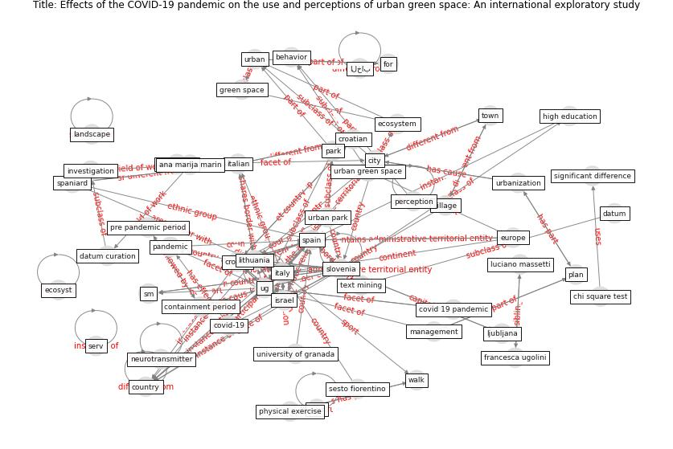

# Article: __Effects of the COVID-19 pandemic on the use and perceptions of urban green space: An international exploratory study__ (ugolini_effects_2020)

* [10.1016/j.ufug.2020.126888](https://doi.org/10.1016/j.ufug.2020.126888)
* Cluster: [green-urban](cluster_15)

## Keywords

* [italy](keyword_italy), [spain](keyword_spain), israel, [slovenia](keyword_slovenia), [croatia](keyword_croatia), [ug](keyword_ug), [chi - square test](keyword_chi_-_square_test), [pandemic](keyword_pandemic), [urban](keyword_urban), [city](keyword_city), [plan](keyword_plan), containment period, [covid-19 pandemic](keyword_covid-19_pandemic), [covid-19](keyword_covid-19), [italian](keyword_italian)

## Keywords at large

* [italy](keyword_italy), [spain](keyword_spain), [slovenia](keyword_slovenia), [croatia](keyword_croatia), [ug](keyword_ug), [pandemic](keyword_pandemic), [chi - square test](keyword_chi_-_square_test), [city](keyword_city), [urban](keyword_urban)

## Concepts

 

### Closest articles 

* [Green in times of COVID-19: urban green space relevance during the COVID-19 pandemic in Buenos Aires City](article_marconi_green_2022)
* [Urban Green Infrastructure and Green Open Spaces: An Issue of Social Fairness in Times of COVID-19 Crisis](article_reinwald_urban_2021)
* [Association between indoor-outdoor green features and psychological health during the COVID-19 lockdown in Italy: A cross-sectional nationwide study](article_spano_association_2021)
* [Blockchain technology and its applications to combat COVID-19 pandemic](article_sharma_blockchain_2022)
* [Home garden use during COVID-19: Associations with physical and mental wellbeing in older adults](article_corley_home_2021)
* [Refleksioner fra en pandemi](article_realdania_refleksioner_2022)
* [Pandemiens arkitektur](article_realdania_pandemiens_2022)
* [Mental health economics: A prospective study on psychological flourishing and associations with healthcare costs and sickness benefit transfers in Denmark](article_santini_mental_2021)
* [Psychological Effects of Home Confinement and Social Distancing Derived from COVID-19 in the General Population—A Systematic Review](article_rodriguez-fernandez_psychological_2021)
* [Treating two pandemics for the price of one: Chronic and infectious disease impacts of the built and natural environment](article_frank_treating_2021)

