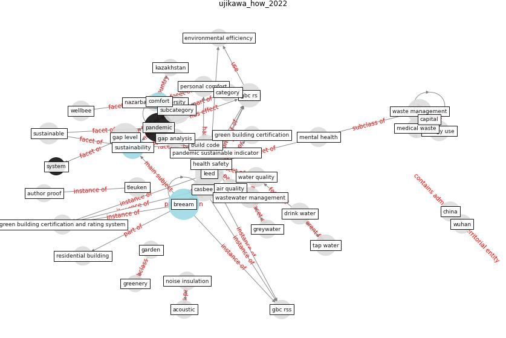

# Article: __How to Make Green Building Certification &amp; Rating Systems More Pandemic-Sustainable?__ (ujikawa_how_2022)

* [10.1007/978-981-19-1704-2_23](https://doi.org/10.1007/978-981-19-1704-2_23)
* Cluster: [building-health](cluster_10)

## Keywords

[pandemic](keyword_pandemic)

## Concepts

 

### References 

* [Readiness Assessment of Green Building
Certification Systems for Residential Buildings
during Pandemics](article_tleuken_readiness_2021)

### Cited by 

