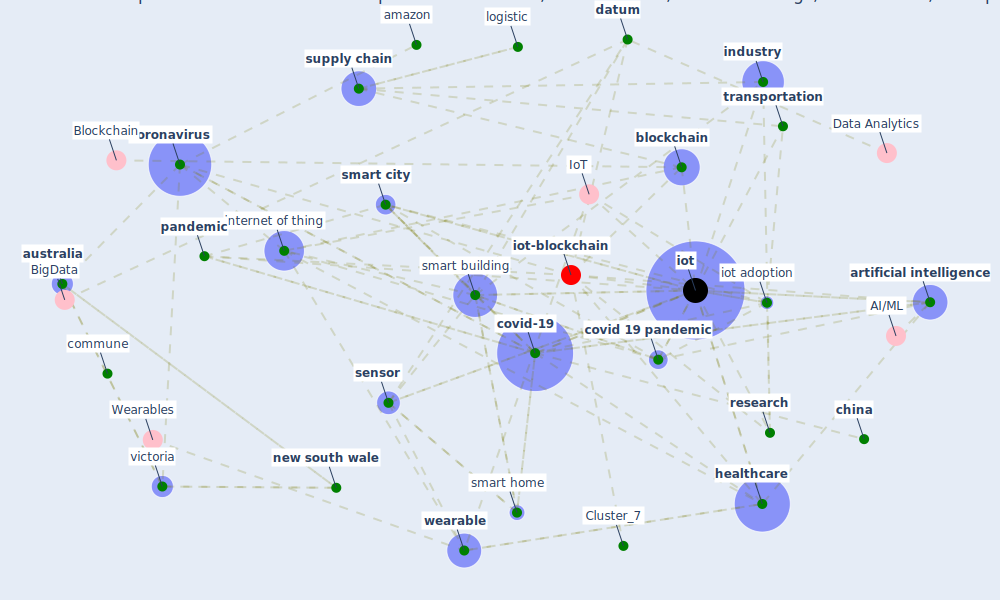

# Article: Impact of COVID-19 on IoT Adoption in Healthcare, Smart Homes, Smart Buildings, Smart Cities, Transportation and Industrial IoT (umair_impact_2021)

* Source: [10.3390/s21113838](https://doi.org/10.3390/s21113838)
* Year: 2021
* Cluster: [datum-iot](cluster_4)

## Keywords

 * alexa, amazon, [analytic](keyword_analytic), apple, [application](keyword_application), [artificial intelligence](keyword_artificial_intelligence), [australia](keyword_australia), bai, bbc, [berlin](keyword_berlin), [big datum](keyword_big_datum), [blockchain](keyword_blockchain), [canada](keyword_canada), [china](keyword_china), commune, conference, contact trace, [coronavirus](keyword_coronavirus), [covid 19 pandemic](keyword_covid_19_pandemic), [covid-19](keyword_covid-19), [datum](keyword_datum), datum analytic, datum center, datum integration, [denmark](keyword_denmark), development, [device](keyword_device), [diabete](keyword_diabete), [disinfection](keyword_disinfection), e commerce, emergency, forecast, fromm, [germany](keyword_germany), [government](keyword_government), [healthcare](keyword_healthcare), [hvac](keyword_hvac), iiot, [india](keyword_india), [industry](keyword_industry), [internet](keyword_internet), [internet of thing](keyword_internet_of_thing), inventory management, [iot](keyword_iot), iot adoption, iphone, javaid, key research direction, kinnunen, [logistic](keyword_logistic), [london](keyword_london), luu, major challenge, [manhattan](keyword_manhattan), [manufacture](keyword_manufacture), metab, mobile application, mokbel, [new south wale](keyword_new_south_wale), [new york city](keyword_new_york_city), nguyen, [organisation](keyword_organisation), palladam, [pandemic](keyword_pandemic), patel, [privacy](keyword_privacy), [public transport](keyword_public_transport), re internet re, recession, [research](keyword_research), [robot](keyword_robot), [sector](keyword_sector), [sensor](keyword_sensor), singapore, [smart](keyword_smart), [smart building](keyword_smart_building), [smart city](keyword_smart_city), smart home, smart hvac, smart logistic, smartphone, [supply chain](keyword_supply_chain), [surveillance](keyword_surveillance), [switzerland](keyword_switzerland), [technology](keyword_technology), [telehealth](keyword_telehealth), test and trace, test and trace system, [thermostat](keyword_thermostat), track, [transport](keyword_transport), transportation, [united kingdom](keyword_united_kingdom), vaishya, [ventilation](keyword_ventilation), vertical, victoria, wearable, work from home, yang

## Concepts

 

## Neighbours

### Closest articles

* From Viral City to Smart City: Learning from Pandemic Experiences - [LINK](article_sakellarides_viral_2020)
* A Mixed Approach on Resilience of Spanish Dwellings and Households during COVID-19 Lockdown - [LINK](article_cuerdo-vilches_mixed_2020)
* Amplifying the role of knowledge translation platforms in the COVID-19 pandemic response - [LINK](article_el-jardali_amplifying_2020)
* 10 Adaptive Measures for Public Places to face the COVID 19 Pandemic Outbreak - [LINK](article_cheshmehzangi_10_2020)
* Coronavirus questions that will not go away: interrogating urban and socio-spatial implications of COVID-19 measures - [LINK](article_salama_coronavirus_2020)
* Epidemics, Planning and the City: A Special Issue of Planning Perspectives - [LINK](article_davis_epidemics_2022)
* COVID-19: Lessons for an Urban(izing) World - [LINK](article_acuto_covid-19_2020)
* Questioning the use of the balcony in apartments during the COVID-19 pandemic process - [LINK](article_aydin_questioning_2020)

### Closest BPs

* Blueprint: Smart Locker System - [LINK](bp_1)
* Blueprint: Tracking and enforcing use of Personal Protective Equipment - [LINK](bp_23)
* Blueprint: Resilience in staffing and skills training - [LINK](bp_12)
