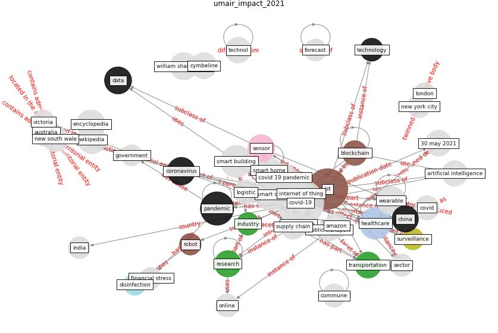

# Article: __Impact of COVID-19 on IoT Adoption in Healthcare, Smart Homes, Smart Buildings, Smart Cities, Transportation and Industrial IoT__ (umair_impact_2021)

* [10.3390/s21113838](https://doi.org/10.3390/s21113838)
* Cluster: [smart-datum](cluster_8)

## Keywords

[iot](keyword_iot), [pandemic](keyword_pandemic), [healthcare](keyword_healthcare), [coronavirus](keyword_coronavirus), [data](keyword_data), [sensor](keyword_sensor)

## Abstract

COVID-19 has disrupted normal life and has enforced a
substantial change in the policies, priorities and
activities of individuals, organisations and governments.
These changes are proving to be a catalyst for technology
and innovation. In this paper, we discuss the pandemic’s
potential impact on the adoption of the Internet of Things
(IoT) in various broad sectors, namely healthcare, smart
homes, smart buildings, smart cities, transportation and
industrial IoT. Our perspective and forecast of this impact
on IoT adoption is based on a thorough research literature
review, a careful examination of reports from leading
consulting firms and interactions with several industry
experts. For each of these sectors, we also provide the
details of notable IoT initiatives taken in the wake of
COVID-19. We also highlight the challenges that need to be
addressed and important research directions that will
facilitate accelerated IoT adoption.

## Concepts

 

### References 

* [Internet of things (IoT) applications to fight against
COVID-19 pandemic](article_singh_internet_2020)
* [Digital technology and COVID-19](article_ting_digital_2020)
* [A Comprehensive Review of the COVID-19 Pandemic
and the Role of IoT, Drones, AI, Blockchain, and
5G in Managing its Impact](article_chamola_comprehensive_2020)
* [Response to COVID-19 in Taiwan: Big Data
Analytics, New Technology, and Proactive
Testing](article_wang_response_2020)
* [Antivirus-built environment: Lessons learned from
Covid-19 pandemic](article_megahed_antivirus-built_2020)
* [2019 Novel Coronavirus (COVID-19) Pandemic:
Built Environment Considerations To Reduce
Transmission](article_dietz_2019_2020)
* [COVID-19 Could Leverage a Sustainable Built
Environment](article_pinheiro_covid-19_2020)
* [Review and comparison of HVAC operation guidelines in
different countries during the COVID-19 pandemic](article_guo_review_2021)
* [Far-UVC light (222 nm) efficiently and safely
inactivates airborne human coronaviruses](article_buonanno_far-uvc_2020)

### Cited by 

* [Prophylactic Architecture: Formulating the Concept
of Pandemic-Resilient Homes](article_elrayies_prophylactic_2022)
