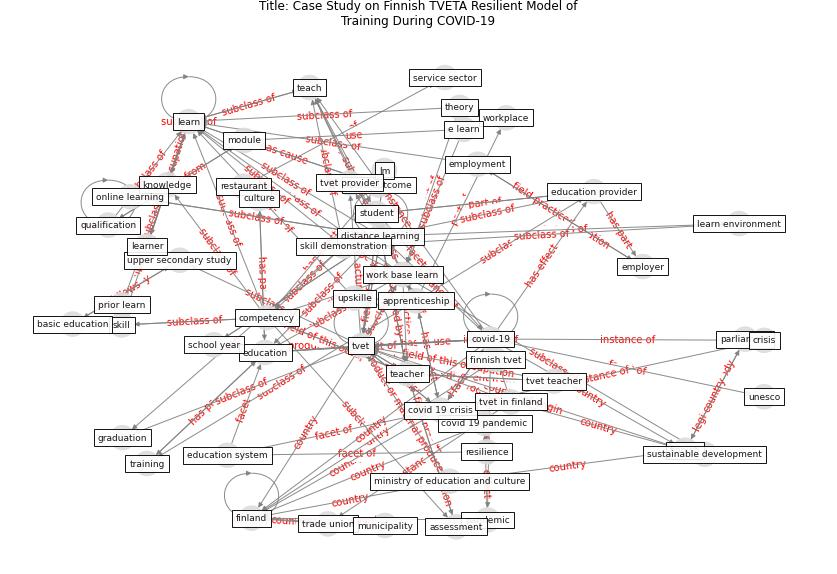

# Article: __Case Study on Finnish TVETA Resilient Model of Training During COVID-19__ (unesco_case_2021)

* URL: [https://unesdoc.unesco.org/ark:/48223/pf0000375471](https://unesdoc.unesco.org/ark:/48223/pf0000375471)
* Year: 2021

## Keywords

* [tvet](keyword_tvet), [finland](keyword_finland), [education](keyword_education), [covid-19](keyword_covid-19), [finnish](keyword_finnish), [learn](keyword_learn), [work base learn](keyword_work_base_learn), [teacher](keyword_teacher), [student](keyword_student), [distance learning](keyword_distance_learning), training, competency, [covid 19 crisis](keyword_covid_19_crisis), apprenticeship, qualification

## Keywords at large

* [biophilic design](keyword_biophilic_design), [architecture](keyword_architecture), [sustainable architecture](keyword_sustainable_architecture), [nature](keyword_nature), [design](keyword_design), [biophilic](keyword_biophilic), [environ](keyword_environ), [biophilia](keyword_biophilia), [wellbeing](keyword_wellbeing), [health](keyword_health)

## Concepts

 

