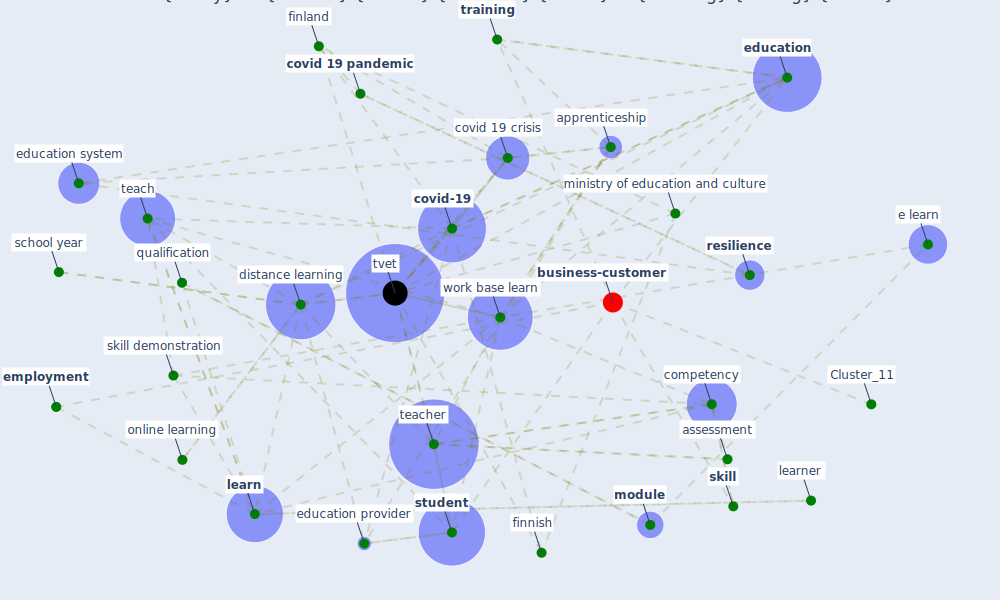

# Article: Case Study on Finnish TVETA Resilient Model of Training During COVID-19 (unesco_case_2021)

* [https://unesdoc.unesco.org/ark:/48223/pf0000375471](https://unesdoc.unesco.org/ark:/48223/pf0000375471)
* Year: 2021
* Cluster: [construction-pandemic](cluster_1)

## Keywords

 * [access](keyword_access), adult, apprenticeship, assessment, autumn, basic education, building resilience in tvet, category12, commerce, communication, [company](keyword_company), competency, [covid 19 crisis](keyword_covid_19_crisis), [covid 19 pandemic](keyword_covid_19_pandemic), [covid-19](keyword_covid-19), [crisis](keyword_crisis), culture, [digitalisation](keyword_digitalisation), distance learning, e learn, [education](keyword_education), education provider, education system, [employer](keyword_employer), employment, face to face learn, [finland](keyword_finland), finnish, finnish government, finnish tvet, foundation, [france](keyword_france), future proof, graduation, helsinki, independent working, [industry](keyword_industry), institutional, instruction, job seek, [knowledge](keyword_knowledge), lay off, layoff, leadership, learn, learn environment, learn management system, learn outcome, [learner](keyword_learner), learning skill, legislation, level of difficulty, lifelong learning, limitation, lm, [management](keyword_management), mentor, ministry of education and culture, module, municipality, online learning, [pandemic](keyword_pandemic), parliament, place de fontenoy, prior learn, provider, qualification, [resilience](keyword_resilience), reskille, restaurant, school year, service sector, skill, skill demonstration, [student](keyword_student), [sustainable development](keyword_sustainable_development), [sustainable development goal](keyword_sustainable_development_goal), synchronous teaching, teach, teacher, technology industry of finland, territory, theory, trade union, [training](keyword_training), [tvet](keyword_tvet), tvet in finland, tvet provider, tvet study, tvet teacher, unemployment, [unesco](keyword_unesco), unevoc, [united nations](keyword_united_nations), university degree, upper secondary study, upskille, [work base learn](keyword_work_base_learn), [workplace](keyword_workplace), youth

## Concepts

 

## Neighbours

### Closest articles

* Using Technology to Maintain the Education of Residents During the COVID-19 Pandemic - [LINK](article_chick_using_2020)
* Significant applications of virtual reality for COVID-19 pandemic - [LINK](article_singh_significant_2020)
* COVID-19: A new digital dawn? - [LINK](article_robbins_covid-19_2020)
* Digital Twin of COVID-19 Mass Vaccination Centers - [LINK](article_pilati_digital_2021)
* Building occupancy estimation with people flow modeling in AnyLogic - [LINK](article_li_building_2016)
* COVID19-Routes: A Safe Pedestrian Navigation Service - [LINK](article_cantarero_covid19-routes_2021)
* EXPOSED: An occupant exposure model for confined spaces to retrofit crowd models during a pandemic - [LINK](article_ronchi_exposed_2020)
* Internet of things (IoT) applications to fight against COVID-19 pandemic - [LINK](article_singh_internet_2020)
* COVID-ABS: An agent-based model of COVID-19 epidemic to simulate health and economic effects of social distancing interventions - [LINK](article_silva_covid-abs_2020)
* Risk Diagnosis and Mitigation System of COVID-19 Using Expert System and Web Scraping - [LINK](article_mufid_risk_2020)

### Closest BPs

* Blueprint: Resilience in staffing and skills training - [LINK](bp_12)
* Blueprint: Air Cleaning Plants - [LINK](bp_15)
* Blueprint: Public places as information points - [LINK](bp_8)
