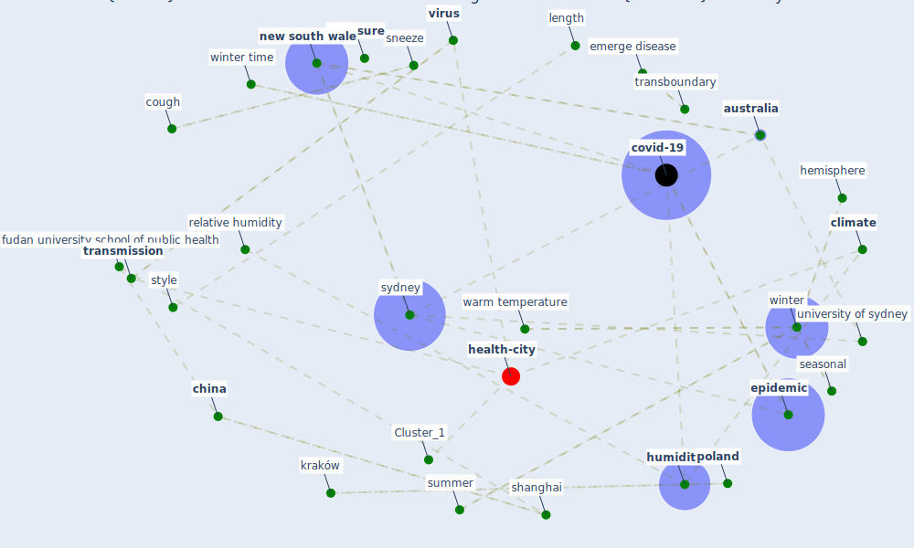

# Article: COVID-19 could be a seasonal illness with higher risk in winter: Reduced humidity linked to increased COVID-19 risk (university_of_sydney_covid-19_2020)

* [https://www.sciencedaily.com/releases/2020/06/200601134608.htm](https://www.sciencedaily.com/releases/2020/06/200601134608.htm)
* Year: 2020
* Cluster: [health-city](cluster_1)

## Keywords

 * 1 percent decrease in humidity, afield, [air](keyword_air), air be, [australia](keyword_australia), case notification, case of covid 19, [china](keyword_china), [climate](keyword_climate), [coronavirus](keyword_coronavirus), cough, covid 19 epidemic in new south wale, covid 19 outbreak, covid 19 outbreak in china, [covid-19](keyword_covid-19), decrease in humidity, [disease](keyword_disease), emerge disease, [epidemic](keyword_epidemic), [exposure](keyword_exposure), fall, fudan, fudan university school of public health, hemisphere, [hong kong](keyword_hong_kong), humid, [humidity](keyword_humidity), illness, kraków, length, leningrad, low humidity, moist, [new south wale](keyword_new_south_wale), [north america](keyword_north_america), northern hemisphere, [pandemic](keyword_pandemic), pandemic in china europe and north america, [poland](keyword_poland), public health system, rainfall, relative humidity, [russia](keyword_russia), seasonal, [shanghai](keyword_shanghai), shanghai china, shuang xiao, sneeze, southern hemisphere, style, summer, summer month, [surveillance](keyword_surveillance), [sydney](keyword_sydney), sydney area, sydney australia, [temperature](keyword_temperature), testing, testing and surveillance, transboundary, [transmission](keyword_transmission), university of sydney, [virus](keyword_virus), warm temperature, weather, weather observation station, [winter](keyword_winter), winter time, zhijie zhang

## Concepts

 

## Neighbours

### Closest articles

* Effects of temperature and humidity on the spread of COVID-19: A systematic review - [LINK](article_mecenas_effects_2020)
* Mechanistic insights into the effect of humidity on airborne influenza virus survival, transmission and incidence - [LINK](article_marr_mechanistic_2019)
* Climate and the spread of COVID-19 - [LINK](article_chen_climate_2021)
* Study of COVID-19 pandemic in London (UK) from urban context - [LINK](article_ghosh_study_2020)
* COVID-19 Higher Mortality in Chinese Regions With Chronic Exposure to Lower Air Quality - [LINK](article_pansini_covid-19_2021)
* Air pollution linked with higher COVID-19 death rates - [LINK](article_harvard_th_chan_schoold_of_public_health_air_2020)
* An investigation of transmission control measures during the first 50 days of the COVID-19 epidemic in China - [LINK](article_tian_investigation_2020)
* The effect of human mobility and control measures on the COVID-19 epidemic in China - [LINK](article_kraemer_effect_2020)
* How drones help cities during the Covid-19 pandemic \textbar TheMayor.EU - [LINK](article_dimitrova_how_2021)
* Nurture to nature via COVID-19, a self-regenerating environmental strategy of environment in global context - [LINK](article_paital_nurture_2020)

### Closest BPs

* Blueprint: Resilience in staffing and skills training - [LINK](bp_12)
* Blueprint: Installing UV in ductwork - [LINK](bp_10)
* Blueprint: Negative pressure rooms - [LINK](bp_13)
