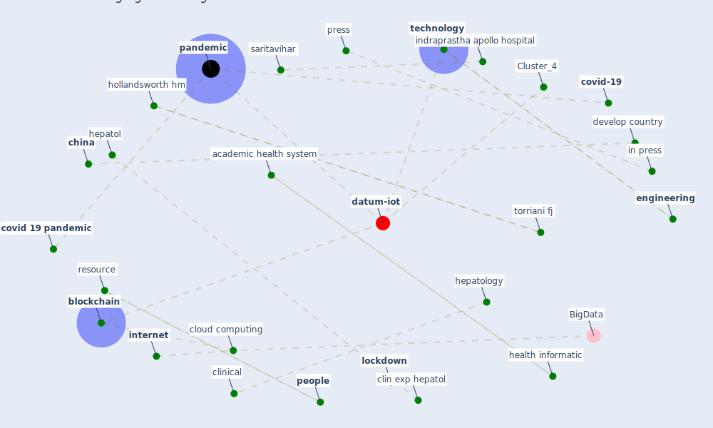

# Article: Emerging Technologies to Combat the COVID-19 Pandemic (vaishya_emerging_2020)

* Source: [10.1016/j.jceh.2020.04.019](https://doi.org/10.1016/j.jceh.2020.04.019)
* Year: 2020
* Cluster: [datum-iot](cluster_4)

## Keywords

 * [3d print](keyword_3d_print), 411 covid, [5 g](keyword_5_g), academic health system, additive manufacturing, agarwal, [analysis](keyword_analysis), [analytic](keyword_analytic), application software, assoc, [big datum](keyword_big_datum), [blockchain](keyword_blockchain), chen a, [china](keyword_china), clin exp hepatol, clinical, cloud computing, community health, computing platform, concept, connect, covid 19 4, covid 19 4 telemedicine, covid 19 outbreak, [covid 19 pandemic](keyword_covid_19_pandemic), [covid-19](keyword_covid-19), credit authorship contribution statement, [datum](keyword_datum), develop country, disease transmission, doctor, [drone](keyword_drone), [engineering](keyword_engineering), [epidemic](keyword_epidemic), facility, [health care](keyword_health_care), health care worker, health informatic, hepatol, [hepatology](keyword_hepatology), hollandsworth hm, in press, [india](keyword_india), indraprastha apollo hospital, industry 4 0, [infection](keyword_infection), [internet](keyword_internet), [internet of thing](keyword_internet_of_thing), j be me inf assoc, j clin exp hepatol, jama, jamaica, jmi ac, [lockdown](keyword_lockdown), man to man contact, med inf assoc, [medical](keyword_medical), minute, mjavaid, mohd javaid, molecular technology, nation, optimize, [pandemic](keyword_pandemic), paper, [people](keyword_people), [poland](keyword_poland), position technology, press, press release, preventive medicine, raju vaishya, rehabilitation, rehabilitation effort, relief, resource, saritavihar, second million, [sector](keyword_sector), smartphone base application software, software, supercompute, supercompute facility, [supply chain](keyword_supply_chain), surprise, [technology](keyword_technology), telecommunication, telecommunication infrastructure, the usa, time of genetic detection, torriani fj, treat such an infectious disease, [treatment](keyword_treatment), unmanned vehicle, vaccine development, vaish, wildfire, worldometer, write some part, xiaoxia

## Concepts

 

## Neighbours

### Closest articles

* Internet of things (IoT) applications to fight against COVID-19 pandemic - [LINK](article_singh_internet_2020)
* The role of 5G for digital healthcare against COVID-19 pandemic: Opportunities and challenges - [LINK](article_siriwardhana_role_2021)
* Leveraging Digital Transformation Technologies to Tackle COVID-19: Proposing a Privacy-First Holistic Framework - [LINK](article_arpaci_leveraging_2021)
* A Comprehensive Review of the COVID-19 Pandemic and the Role of IoT, Drones, AI, Blockchain, and 5G in Managing its Impact - [LINK](article_chamola_comprehensive_2020)
* Mobile Technology Solution for COVID-19: Surveillance and Prevention - [LINK](article_raza_mobile_2021)
* Health Information Exchange with Blockchain amid Covid-19-like Pandemics - [LINK](article_christodoulou_health_2020)
* Digital technology and COVID-19 - [LINK](article_ting_digital_2020)
* Significant applications of virtual reality for COVID-19 pandemic - [LINK](article_singh_significant_2020)
* Blockchain technology and its applications to combat COVID-19 pandemic - [LINK](article_sharma_blockchain_2022)
* How Can Blockchain Help People in the Event of Pandemics Such as the COVID-19? - [LINK](article_chang_how_2020)

### Closest BPs

* Blueprint: Resilience in staffing and skills training - [LINK](bp_12)
* Blueprint: Air Cleaning Plants - [LINK](bp_15)
* Blueprint: Public places as information points - [LINK](bp_8)
