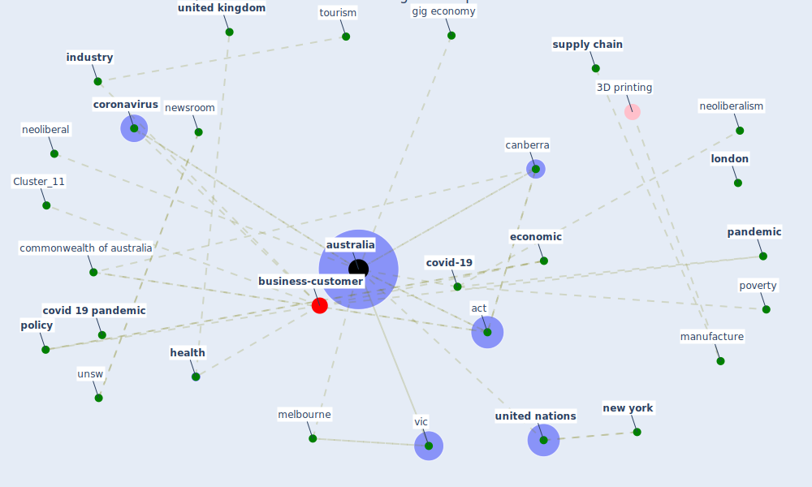

# Article: The COVID-19 pandemic: Lessons on building more equal and sustainable societies (van_barneveld_covid-19_2020)

* Source: [10.1177/1035304620927107](https://doi.org/10.1177/1035304620927107)
* Year: 2020
* Cluster: [construction-pandemic](cluster_1)

## Keywords

 * act, amazon, [australia](keyword_australia), australian government, authorship, can the health care system meet the challenge of pandemic flu, canberra, casual, cbus, cf, [china](keyword_china), coat b, commonwealth of australia, [coronavirus](keyword_coronavirus), [covid 19 crisis](keyword_covid_19_crisis), [covid 19 pandemic](keyword_covid_19_pandemic), [covid-19](keyword_covid-19), cowgill m, [crisis](keyword_crisis), croft j, cuervo h, democratic, develop, discussion paper, doepke m, [economic](keyword_economic), economic and labour relation review, economic system, [economy](keyword_economy), environment and plan a, [europe](keyword_europe), first nation, [fossil fuel](keyword_fossil_fuel), frydenberg, geneva, gig economy, gig worker, good c, [government](keyword_government), hansard, [health](keyword_health), health inequity, [health system](keyword_health_system), health worker, [impact](keyword_impact), [india](keyword_india), indigenous people, [industry](keyword_industry), inequality, [italy](keyword_italy), jobkeeper, jobseeker, labonté r, [london](keyword_london), [manufacture](keyword_manufacture), [melbourne](keyword_melbourne), neoliberal, neoliberalism, [new york](keyword_new_york), newsroom, newstart, north, nsw, ortiz juarez e, [outbreak](keyword_outbreak), [pandemic](keyword_pandemic), [policy](keyword_policy), poverty, privatisation, profit without prosperity, [public health](keyword_public_health), publicly fund, rebecca r, [recovery](keyword_recovery), [research](keyword_research), rich country, schreckert, secretary general, south, [supply chain](keyword_supply_chain), [switzerland](keyword_switzerland), [sydney](keyword_sydney), [tourism](keyword_tourism), treasurer, un secretary general, union, [united kingdom](keyword_united_kingdom), [united nations](keyword_united_nations), university of melbourne, unsw, unu wide, vic, welfare, who, woman, work paper, [worker](keyword_worker), [world health organization](keyword_world_health_organization), ze book, 𒁽van barneveld

## Concepts

 

## Neighbours

### Closest articles

* COVID-19 and the UN Sustainable Development Goals: Threat to Solidarity or an Opportunity? - [LINK](article_leal_filho_covid-19_2020)
* Health, Economic and Social Development Challenges of the COVID-19 Pandemic: Strategies for Multiple and Interconnected Issues - [LINK](article_panneer_health_2022)
* The socio-economic implications of the coronavirus pandemic (COVID-19): A review - [LINK](article_nicola_socio-economic_2020)
* How COVID-19 Redefines the Concept of Sustainability - [LINK](article_hakovirta_how_2020)
* COVID-19: IMPACT OF THE PANDEMIC ON THE SUSTAINABLE DEVELOPMENT GOALS - [LINK](article_samout_covid-19_2020)
* Sustainable work throughout the life course: National policies and strategies, Publications Office of the European Union - [LINK](article_eurofund_sustainable_2016)
* Building up an ecologically sustainable and socially desirable post-COVID-19 future - [LINK](article_duflot_building_2021)
* A critical analysis of the impacts of COVID-19 on the global economy and ecosystems and opportunities for circular economy strategies - [LINK](article_ibn-mohammed_critical_2021)
* Mapping research in logistics and supply chain management during COVID-19 pandemic - [LINK](article_montoya-torres_mapping_2021)
* Amplifying the role of knowledge translation platforms in the COVID-19 pandemic response - [LINK](article_el-jardali_amplifying_2020)

### Closest BPs

* Blueprint: Smart Locker System - [LINK](bp_1)
* Blueprint: Resilience in staffing and skills training - [LINK](bp_12)
* Blueprint: Tracking and enforcing use of Personal Protective Equipment - [LINK](bp_23)
