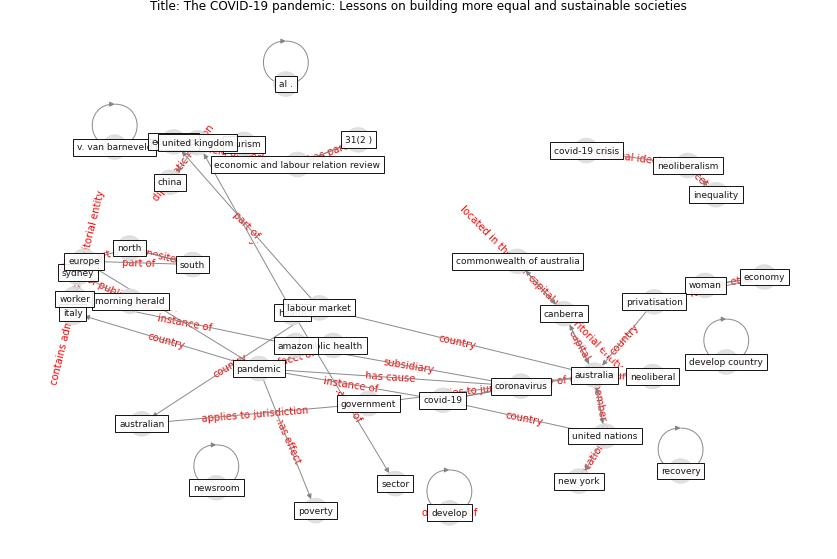

# Article: __The COVID-19 pandemic: Lessons on building more equal and sustainable societies__ (van_barneveld_covid-19_2020)

* [10.1177/1035304620927107](https://doi.org/10.1177/1035304620927107)
* Cluster: [health-building](cluster_9)

## Keywords

* [australia](keyword_australia), [pandemic](keyword_pandemic), [covid-19](keyword_covid-19), [economic](keyword_economic), [coronavirus](keyword_coronavirus), [supply chain](keyword_supply_chain), [economic and labour relation review](keyword_economic_and_labour_relation_review), [labour market](keyword_labour_market), [covid-19 pandemic](keyword_covid-19_pandemic), [china](keyword_china), [sydney](keyword_sydney), neoliberalism, [government](keyword_government), neoliberal, [tourism](keyword_tourism)

## Keywords at large

* [australia](keyword_australia), [pandemic](keyword_pandemic), [covid-19](keyword_covid-19), [economic](keyword_economic), [coronavirus](keyword_coronavirus), [al .](keyword_al_.), [v. van barneveld](keyword_v._van_barneveld), [supply chain](keyword_supply_chain), [economic and labour relation review](keyword_economic_and_labour_relation_review), [labour market](keyword_labour_market)

## Abstract

This discussion paper by a group of scholars across the
fields of health, economics and labour relations argues
that COVID-19 is an unprecedented humanitarian crisis from
which there can be no return to the ‘old normal’. The
pandemic’s disastrous worldwide health impacts have been
exacerbated by, and have compounded, the unsustainability
of economic globalisation based on the neoliberal
dismantling of state capabilities in favour of markets.
Flow-on economic impacts have simultaneously created major
supply and demand disruptions, and highlighted the growing
within-country inequalities and precarity generated by
neoliberal regimes of labour market regulation. Taking an
Australian and international perspective, we examine these
economic and labour market impacts, paying particular
attention to differential impacts on First Nations people,
developing countries, women, immigrants and young people.
Evaluating policy responses in a political climate of
national and international leadership very different from
those in which major twentieth century crises were
addressed, we argue the need for a national and
international conversation to develop a new pathway out of
crisis. JEL Codes: E18, HO, I1, J64, J88

## Concepts

 

### Closest articles 

* [COVID-19 and the UN Sustainable Development Goals: Threat to Solidarity or an Opportunity?](article_leal_filho_covid-19_2020)
* [COVID-19: IMPACT OF THE PANDEMIC ON THE SUSTAINABLE DEVELOPMENT GOALS](article_samout_covid-19_2020)
* [Health, Economic and Social Development Challenges of the COVID-19 Pandemic: Strategies for Multiple and Interconnected Issues](article_panneer_health_2022)
* [How COVID-19 Redefines the Concept of Sustainability](article_hakovirta_how_2020)
* [Sustainable work throughout the life course: National
policies and strategies, Publications Office of the
European Union](article_eurofund_sustainable_2016)
* [A critical analysis of the impacts of COVID-19 on the global economy and ecosystems and opportunities for circular economy strategies](article_ibn-mohammed_critical_2021)
* [Urban planning after COVID-19](article_rtpi_urban_2021)
* [Mapping research in logistics and supply chain management during COVID-19 pandemic](article_montoya-torres_mapping_2021)
* [Global value chains: Efficiency and risks in the context of COVID-19](article_oecd_global_2021)
* [What has been the impact of the COVID-19 pandemic on immigrants? An update on recent evidence](article_oecd_what_2022)

