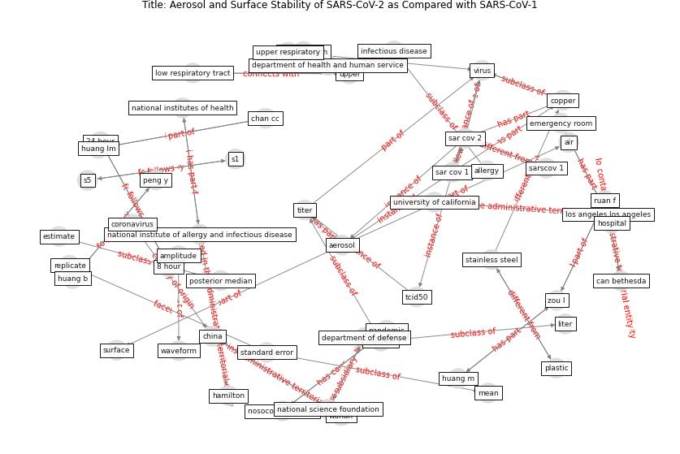

# Article: Aerosol and Surface Stability of SARS-CoV-2 as Compared with SARS-CoV-1 (van_doremalen_aerosol_2020)

* Source: [10.1056/NEJMc2004973](https://doi.org/10.1056/NEJMc2004973)
* Year: 2020
* Cluster: [city-health](cluster_14)

## Keywords

 * 1 n engl j med, 24 hour, 8 hour, 95 credible interval, [aerosol](keyword_aerosol), [air](keyword_air), allergy, amplitude, asymptomatic, atlanta, b sc, bushmaker, can bethesda, can brandi, cell host, center for disease control and prevention, chan cc, [china](keyword_china), [copper](keyword_copper), [coronavirus](keyword_coronavirus), department of defense, department of health and human service, emergency room, end point titration, estimate, estimate difference, experimental, ga james, half life, halflife, hamilton, [hospital](keyword_hospital), hospital emergency room, huang b, huang lm, huang m, infectious, [infectious disease](keyword_infectious_disease), infectious dose, initial virus titer, intercept, line, liter, logarithmic scale, los angeles los angeles, low respiratory tract, mean, microbe, milliliter, mt amandine gamble, national institute of allergy and infectious disease, national institutes of health, national science foundation, new england journal of medicine, ng l, [nih](keyword_nih), nj myndi g holbrook, nosocomial spread, [pandemic](keyword_pandemic), peng y, plastic, posterior median, [public health](keyword_public_health), quantify, regression plot, relative humidity, replicate, respiratory tract, ruan f, s1, s5, [sar cov 1](keyword_sar_cov_1), [sar cov 2](keyword_sar_cov_2), sarscov 1, science foundation, severe acute respiratory syndrome coronavirus 2, specimen, [stainless steel](keyword_stainless_steel), standard error, strain, super spread event, [surface](keyword_surface), tcid50, [temperature](keyword_temperature), the n e w e ng l a n d j o u r na l of m e, [time](keyword_time), tin, tissue culture, titer, transmit, trenton bushmaker, university of california, university princeton, [upper](keyword_upper), upper respiratory, [virus](keyword_virus), virus titer, waveform, [wuhan](keyword_wuhan), zou l

## Concepts

 

## Neighbours

### Closest articles

* Sustainability of Coronavirus on Different Surfaces - [LINK](article_suman_sustainability_2020)
* Persistence of coronaviruses on inanimate surfaces and their inactivation with biocidal agents - [LINK](article_kampf_persistence_2020)
* A Surface Coating that Rapidly Inactivates SARS-CoV-2 - [LINK](article_behzadinasab_surface_2020)
* Sars-CoV-2 (COVID-19) inactivation capability of copper-coated touch surface fabricated by cold-spray technology - [LINK](article_hutasoit_sars-cov-2_2020)
* Graphene-based nanomaterials as antimicrobial surface coatings: A parallel approach to restrain the expansion of COVID-19 - [LINK](article_ayub_graphene-based_2021)
* A Continuously Active Antimicrobial Coating effective against Human Coronavirus 229E - [LINK](article_ikner_continuously_2020)
* Current knowledge of COVID-19: Advances, challenges and future perspectives - [LINK](article_wu_current_2021)
* COVID-19 Pandemic: Prevention and Protection Measures to Be Adopted at the Workplace - [LINK](article_cirrincione_covid-19_2020)
* KIX to apply antimicrobial coating in its fight against COVID-19 - [LINK](article_kansai_airport_kix_2021)
* COVID-19 and its Modes of Transmission - [LINK](article_karia_covid-19_2020)

### Closest BPs

* Blueprint: Antimicrobial Surfaces - [LINK](bp_5)
* Blueprint: Installing high-efficiency air filters - [LINK](bp_11)
* Blueprint: Good hand hygiene practice - [LINK](bp_16)
