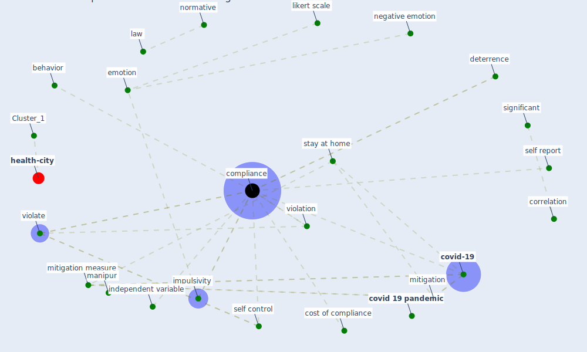

# Article: Compliance with COVID-19 Mitigation Measures in the United States (van_rooij_compliance_2020)

* Source: [10.31234/osf.io/qymu3](https://doi.org/10.31234/osf.io/qymu3)
* Year: 2020
* Cluster: [construction-pandemic](cluster_1)

## Keywords

 * I o research, behavior, behaviour, benjamin van rooij, [california](keyword_california), cambridge university press, [capacity](keyword_capacity), [china](keyword_china), [compliance](keyword_compliance), comply, conservative, [control](keyword_control), control variable, [coronavirus](keyword_coronavirus), correlation, cortney simmons, cost of compliance, [covid 19 pandemic](keyword_covid_19_pandemic), [covid-19](keyword_covid-19), crime, criminology, d daniel sokol, daniel s, dependent variable, [deterrence](keyword_deterrence), deterrent, disobey, emotion, factor, [fear](keyword_fear), francis t cullen, friend, gavin newsom, gender, governor, impulsive, impulsivity, income, independent variable, [india](keyword_india), [infection](keyword_infection), justice, [law](keyword_law), liberal, likert, likert scale, [manhattan](keyword_manhattan), [manipur](keyword_manipur), [measure](keyword_measure), [meta analysis](keyword_meta_analysis), mexico, [mitigation](keyword_mitigation), mitigation measure, morally, my wife and child, negative emotion, [new jersey](keyword_new_jersey), [new york city](keyword_new_york_city), non normative, normative, normative obligation to obey the law, obligation, outbreak of the virus, [pandemic](keyword_pandemic), peke university, perceive threat, perception, police, [policy](keyword_policy), politicalorientation, progressive, [psychological](keyword_psychological), rapport, reason, relative, reverse code, robert b, sanction, self control, self report, significant, [society](keyword_society), [state](keyword_state), stay at home, strain, strain theory, [survey](keyword_survey), travis c, [trenton](keyword_trenton), truly freeconsent, trust in medium, trust in science, [united states](keyword_united_states), universiteit twente, variation, violate, [violation](keyword_violation), yuval, αντιση, چک

## Concepts

 

## Neighbours

### Closest articles

* The Intelligent Lockdown: Compliance with COVID-19 Mitigation Measures in the Netherlands - [LINK](article_kuiper_intelligent_2020)
* Mitigation strategies and compliance in the COVID-19 fight; how much compliance is enough? - [LINK](article_mukerjee_mitigation_2021)
* DfMA for rapid adaptive resilience and flexible infrastructure - [LINK](article_mott_macdonald_dfma_2020)
* Preparing critical infrastructure for the future: Lessons learnt from the Covid-19 pandemic - [LINK](article_tomalska_preparing_2022)
* COVID-19 as a Harbinger of Transforming Infrastructure Resilience - [LINK](article_carvalhaes_covid-19_2020)
* A comprehensive review on indoor air quality monitoring systems for enhanced public health - [LINK](article_saini_comprehensive_2020)
* A review of definitions and measures of system resilience - [LINK](article_hosseini_review_2016)
* COVID-19 and a new resilient infrastructure landscape - [LINK](article_oecd_covid-19_2021)
* Guidelines for resilience systems analysis - [LINK](article_oecd_guidelines_2014)
* How Can Blockchain Help People in the Event of Pandemics Such as the COVID-19? - [LINK](article_chang_how_2020)

### Closest BPs

* Blueprint: Antimicrobial Surfaces - [LINK](bp_5)
* Blueprint: Reducing contact points - [LINK](bp_17)
* Blueprint: Good hand hygiene practice - [LINK](bp_16)
