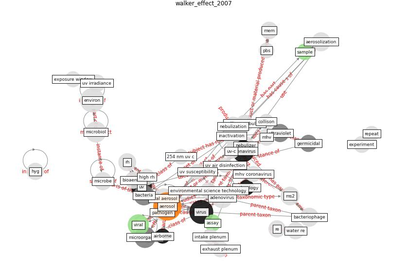

# Article: Effect of Ultraviolet Germicidal Irradiation on Viral Aerosols (walker_effect_2007)

* Source: [10.1021/es070056u](https://doi.org/10.1021/es070056u)
* Year: 2007
* Cluster: [air-uv](cluster_2)

## Keywords

 * 254 nm, 254 nm uv c, 8 ko g, 9ボット, a549, adenovirus, aerodynamic diameter, [aerosol](keyword_aerosol), aerosol sci, aerosolization, agi 30, [airborne](keyword_airborne), airflow, andg, apply, arch, [assay](keyword_assay), assoc, [bacteria](keyword_bacteria), bacteriophage, be be, [bioaerosol](keyword_bioaerosol), biomedical, cell line, collison, [coronavirus](keyword_coronavirus), dunton h, envelop virus, environmental science technology, exhaust plenum, experiment, experimental chamber, exposure chamber, exposure window, fbs, [finland](keyword_finland), first m w, health perspect, hernandez m, high rh, [hospital](keyword_hospital), humidifier, impingement, impinger, inactivate, inactivation, incubate, infectious, intake plenum, irradiance, isolation room, j j tuberc, l min, liquid impinger, logarithm, [london](keyword_london), low rh, lumalier, lung, mem, mhv, mhv coronavirus, microbe, [microbiol](keyword_microbiol), [microorganism](keyword_microorganism), ms2, mycobacterium, nebulization, nebulizer, non ionizing, nucleic acid, [particle](keyword_particle), particle size, [pathogen](keyword_pathogen), pbs, peccia j, percent survival, protein, repeat, rh, [sample](keyword_sample), sars coronavirus, severe acute respiratory syndrome, statistically significant, test, [transmission](keyword_transmission), [ultraviolet](keyword_ultraviolet), [united kingdom](keyword_united_kingdom), [uv](keyword_uv), uv air disinfection, uv exposure window, uv inactivation, uv irradiance, [uv-c](keyword_uv-c), [uvgi](keyword_uvgi), [viral](keyword_viral), viral aerosol, viralaerosol, [virus](keyword_virus), z value

## Concepts

 

## Neighbours

### Closest articles

* Upper-room ultraviolet air disinfection might help to reduce COVID-19 transmission in buildings: a feasibility study - [LINK](article_beggs_upper-room_2020)
* Behind the Update: ASHRAE Handbook Chapters on UV-C to Include Updated Best Practices, Guidance - [LINK](article_ashrae_behind_2020)
* Far-UVC light (222 nm) efficiently and safely inactivates airborne human coronaviruses - [LINK](article_buonanno_far-uvc_2020)
* Efficacy of an Automated Multiple Emitter Whole-Room Ultraviolet-C Disinfection System Against Coronaviruses MHV and MERS-CoV - [LINK](article_bedell_efficacy_2016)
* Case Study: Using Germicidal UV-C to Mitigate COVID-19 - HVAC - [LINK](article_healthcare_facilities_today_case_2021)
* Upper-Room Ultraviolet Light and Negative Air Ionization to Prevent Tuberculosis Transmission - [LINK](article_escombe_upper-room_2009)
* Applications of ultraviolet germicidal irradiation disinfection in health care facilities: Effective adjunct, but not stand-alone technology - [LINK](article_memarzadeh_applications_2010)
* Air Disinfection for Airborne Infection Control with a Focus on COVID‐19: Why Germicidal UV is Essential             † - [LINK](article_nardell_air_2021)
* Methods for air cleaning and protection of building occupants from airborne pathogens - [LINK](article_bolashikov_methods_2009)

### Closest BPs

* Blueprint: Installing UV in ductwork - [LINK](bp_10)
* Blueprint: Installing high-efficiency air filters - [LINK](bp_11)
* Blueprint: Negative pressure rooms - [LINK](bp_13)
