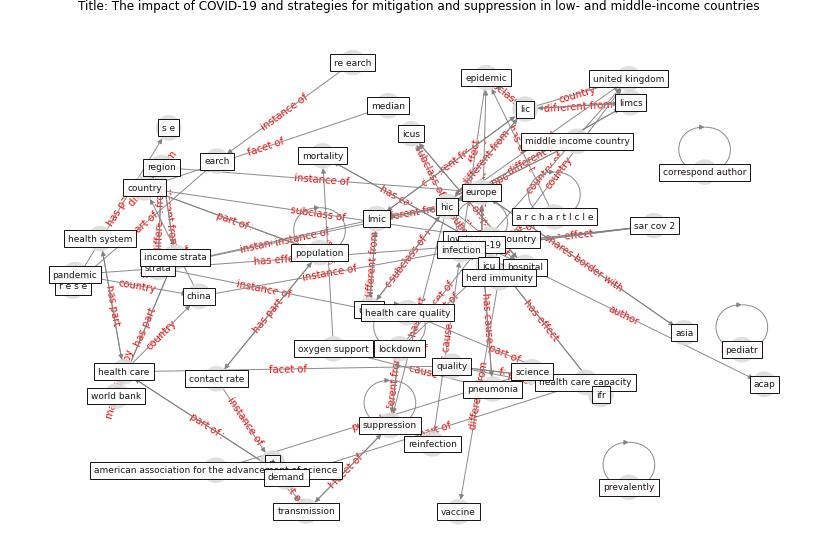

# Article: The impact of COVID-19 and strategies for mitigation and suppression in low- and middle-income countries (walker_impact_2020)

* Source: [10.1126/science.abc0035](https://doi.org/10.1126/science.abc0035)
* Year: 2020
* Cluster: [health-patient](cluster_14)

## Keywords

 * a r c h a r t I c l e, acap, [africa](keyword_africa), american association for the advancement of science, asia, [china](keyword_china), contact rate, contact trace, copd, correspond author, [country](keyword_country), covid 19 epidemic, [covid 19 pandemic](keyword_covid_19_pandemic), [covid-19](keyword_covid-19), demand, develop, develop economy, eabb6936, earch, [epidemic](keyword_epidemic), [europe](keyword_europe), first suppression, [health care](keyword_health_care), health care capacity, health care quality, health protection research unit, [health system](keyword_health_system), herd immunity, [hic](keyword_hic), high income country, high income setting, [hiv](keyword_hiv), [hospital](keyword_hospital), hospitalization, [icu](keyword_icu), icus, ifr, income strata, [infection](keyword_infection), [infectious disease](keyword_infectious_disease), intervention, [lic](keyword_lic), limcs, [lmic](keyword_lmic), lmic lic, [lockdown](keyword_lockdown), [low](keyword_low), low income, low income country, low income setting, median, middle east, middle income country, [mitigation](keyword_mitigation), mitigative strategy, [model](keyword_model), [mortality](keyword_mortality), nihr, no mv, no oxygen, north africa, npis, old age category, oxygen support, p g, p g w, pacific, [pandemic](keyword_pandemic), pediatr, [perspective](keyword_perspective), physiologist, pneumonia, [population](keyword_population), prevalently, [quality](keyword_quality), quantity, r e s e, r verity, re earch, re fe rence and n ot es walker, region, reinfection, [rt](keyword_rt), s e, [sar cov 2](keyword_sar_cov_2), science, socioeconomic, strata, [supply](keyword_supply), [suppression](keyword_suppression), suppression threshold, testing, [transmission](keyword_transmission), umic, uncertainty, [united kingdom](keyword_united_kingdom), [vaccine](keyword_vaccine), walker, [world bank](keyword_world_bank), zenodo

## Concepts

 

## Neighbours

### Closest articles

* COVID-19 and social inequalities: a complex and dynamic interaction - [LINK](article_quantin_covid-19_2022)
* COVID-19 and the rise of intimate partner violence - [LINK](article_aguero_covid-19_2021)
* The Socio-Spatial Determinants of COVID-19 Diffusion: The Impact of Globalisation, Settlement Characteristics and Population - [LINK](article_sigler_socio-spatial_2020)
* Contributions to the mitigation of the COVID-19 pandemic - [LINK](article_pilz_contributions_2022)
* Multilevel Analysis of Personal, Non-Medical COVID-19-Related Impact Worldwide - [LINK](article_dye_multilevel_2020)
* Coronavirus disease 2019: The harms of exaggerated information and non‐evidence‐based measures - [LINK](article_ioannidis_coronavirus_2020)
* Covid-19 and community mitigation strategies in a pandemic - [LINK](article_ebrahim_covid-19_2020)
* The socio-economic determinants of COVID-19: A spatial analysis of German county level data - [LINK](article_ehlert_socio-economic_2021)
* Mental health economics: A prospective study on psychological flourishing and associations with healthcare costs and sickness benefit transfers in Denmark - [LINK](article_santini_mental_2021)
* What has been the impact of the COVID-19 pandemic on immigrants? An update on recent evidence - [LINK](article_oecd_what_2022)

### Closest BPs

* Blueprint: Resilience in staffing and skills training - [LINK](bp_12)
* Blueprint: Architecture design - [LINK](bp_2)
* Blueprint: Monitoring of wastewater - [LINK](bp_21)
