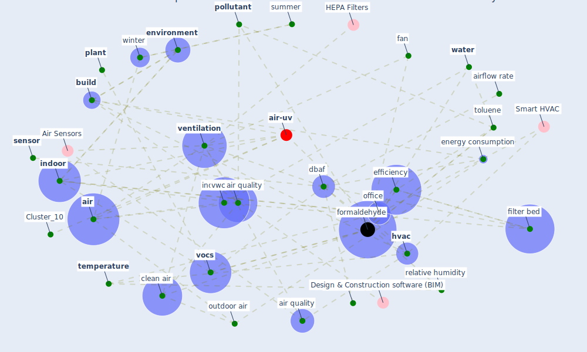

# Article: Characterization and performance evaluation of a full-scale activated carbon-based dynamic botanical air filtration system for improving indoor air quality (wang_characterization_2011)

* Source: [10.1016/j.buildenv.2010.10.008](https://doi.org/10.1016/j.buildenv.2010.10.008)
* Year: 2011
* Cluster: [air-uv](cluster_10)

## Keywords

 * 3rd 4th, 4th, activate carbon, adsorb, [air](keyword_air), air clean, air quality, air temperature, airflow, airflow rate, bed, [build](keyword_build), campbell, chamber test, clean air, [climate](keyword_climate), climate zone, compound, cool, cubicle, [dbaf](keyword_dbaf), decay rate, degradation, designbuilder, efficiencie, efficiency, eia, emission factor, [energy consumption](keyword_energy_consumption), energy efficient, energyplus, [environment](keyword_environment), epa, fan, [formaldehyde](keyword_formaldehyde), guo h, [health](keyword_health), heating, [hvac](keyword_hvac), [hvac system](keyword_hvac_system), [indoor](keyword_indoor), [indoor air quality](keyword_indoor_air_quality), inlet, insoluble, irrigation, irrigation system, mass spectrometer, [microorganism](keyword_microorganism), moisture, murray f, [new york](keyword_new_york), [new york city](keyword_new_york_city), normalize, normalize formaldehyde concentration, normalize toluene concentration, office, operation mode, outdoor air, outlet, particleboard, pilger c, [plant](keyword_plant), [pollutant](keyword_pollutant), pothos, relative humidity, [rh](keyword_rh), rhizosphere, root system, [sensor](keyword_sensor), sep, sf6, side view, [simulation](keyword_simulation), sorbent, summer, syracuse, [temperature](keyword_temperature), test chamber, [toluene](keyword_toluene), toluene equivalent, top view, tracer gas, [ventilation](keyword_ventilation), voc, voc removal, [vocs](keyword_vocs), volatile organic compound, volumetric water content, vwc, [water](keyword_water), water content, water soluble, [winter](keyword_winter), wolverton, wood ra, work cubicle, xylene, zhang j, filter, filter bed

## Concepts

 

## Neighbours

### Closest articles

* The Effect of Opening Windows on Air Change Rates in Two Homes - [LINK](article_howard-reed_effect_2002)
* The effect of a redesigned floor plan, occupant density and the quality of indoor climate on the cost of space, productivity and sick leave in an office building–A case study - [LINK](article_saari_effect_2006)
* A comprehensive review on indoor air quality monitoring systems for enhanced public health - [LINK](article_saini_comprehensive_2020)
* Indoor Air Quality: Rethinking rules of building design strategies in post-pandemic architecture - [LINK](article_megahed_indoor_2021)
* Real-world data show that filters clean COVID-causing virus from air - [LINK](article_thompson_real-world_2021)
* Designing Post COVID-19 Buildings: Approaches for Achieving Healthy Buildings - [LINK](article_navaratnam_designing_2022)
* It’s time to reimagine where and how work will get done (PwC’s US Remote Work Survey) - [LINK](article_pricewaterhousecoopers_its_2021)
* Sustainable work throughout the life course: National policies and strategies, Publications Office of the European Union - [LINK](article_eurofund_sustainable_2016)
* Smart buildings: how a virus might lead to healthier buildings - Arup - [LINK](article_lam_smart_2021)

### Closest BPs

* Blueprint: Air Cleaning Plants - [LINK](bp_15)
* Blueprint: Indoor Environmental Quality (IEQ) monitoring system - [LINK](bp_3)
* Blueprint: Installing high-efficiency air filters - [LINK](bp_11)
