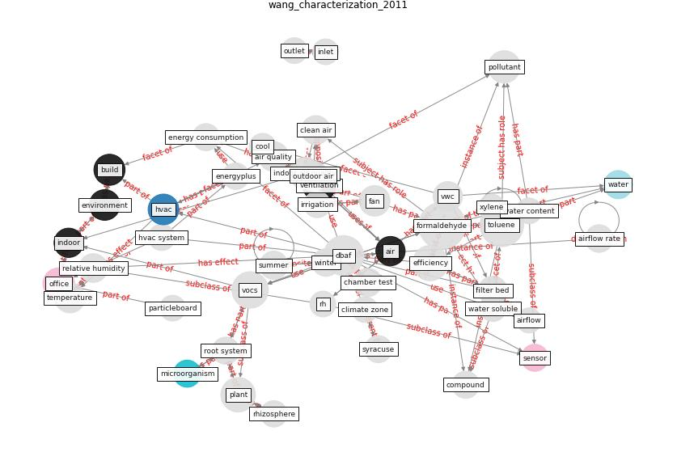

# Article: __Characterization and performance evaluation of a full-scale activated carbon-based dynamic botanical air filtration system for improving indoor air quality__ (wang_characterization_2011)

* [10.1016/j.buildenv.2010.10.008](https://doi.org/10.1016/j.buildenv.2010.10.008)
* Cluster: [air-sars](cluster_0)

## Keywords

* [formaldehyde](keyword_formaldehyde), [toluene](keyword_toluene), [dbaf](keyword_dbaf), [vocs](keyword_vocs), [efficiency](keyword_efficiency), [plant](keyword_plant), [ventilation](keyword_ventilation), [pollutant](keyword_pollutant), [build](keyword_build), [office](keyword_office), [indoor air quality](keyword_indoor_air_quality), [fan](keyword_fan), [hvac](keyword_hvac), [environment](keyword_environment), [temperature](keyword_temperature)

## Keywords at large

* [formaldehyde](keyword_formaldehyde), [toluene](keyword_toluene), [dbaf](keyword_dbaf), [vocs](keyword_vocs), [efficiency](keyword_efficiency), [plant](keyword_plant), [ventilation](keyword_ventilation), [pollutant](keyword_pollutant), [build](keyword_build), [indoor air quality](keyword_indoor_air_quality)

## Abstract

A dynamic botanical air filtration system (DBAF) was
developed for evaluating the short and long-term
performance of botanical air cleaning technology under
realistic indoor conditions. It was a fan-assisted with
controlled airflow, activated-carbon/hydroculture based
potted plant unit. The DBAF was first tested using a
full-scale stainless chamber to evaluate its short-term
performance. It was then integrated in the HVAC system of a
new office space (96.8 m2) to study the effects of
moisture content in the root bed on the removal efficiency,
and the long-term performance. The results indicated that
5\% outdoor air plus botanical filtration lead to the
similar indoor formaldehyde/toluene concentration level as
25\% outdoor air without filtration, which means that the
filtration system was equivalent to 20\% outdoor air
(476 m3/h). The DBAF was effective for removing both
formaldehyde and toluene under 5–32\% volumetric water
content of the root bed. It also performed consistently
well over the relatively long testing period of 300 days
while running continuously. The reduction in outdoor
ventilation rate while using the botanical filtration
system to maintain acceptable air quality would lead to
10–15\% energy saving for the cold climate (Syracuse,
NY), based on simulation analysis using EnergyPlus. For
winter condition, the filter was also found to increase the
supply air RH by 20\%, which would decrease the dryness of
air. For summer condition, the increase of RH in summer
would be within 15\% of the RH condition when no botanical
air filtration is present.

## Concepts

 

### Closest articles 

* [The Effect of Opening Windows on Air Change Rates in Two Homes](article_howard-reed_effect_2002)
* [A comprehensive review on indoor air quality monitoring systems for enhanced public health](article_saini_comprehensive_2020)
* [The effect of a redesigned floor plan, occupant density and the quality of indoor climate on the cost of space, productivity and sick leave in an office building–A case study](article_saari_effect_2006)
* [The effect of occupant distribution on energy consumption and COVID-19 infection in buildings: A case study of university building](article_mokhtari_effect_2021)
* [Reflecting on Impacts of COVID19 on Sustainable Buildings and Cities](article_gonzalez_reflecting_2021)
* [Smart buildings: how a virus might lead to healthier
buildings - Arup](article_lam_smart_2021)
* [Designing Post COVID-19 Buildings: Approaches for Achieving Healthy Buildings](article_navaratnam_designing_2022)
* [Ten questions concerning occupant health in buildings during normal operations and extreme events including the COVID-19 pandemic](article_awada_ten_2021)
* [Addressing the impact of COVID-19 lockdown on energy use in municipal buildings: A case study in Florianópolis, Brazil](article_geraldi_addressing_2021)
* [Indoor Air Quality: Rethinking rules of building design strategies in post-pandemic architecture](article_megahed_indoor_2021)

