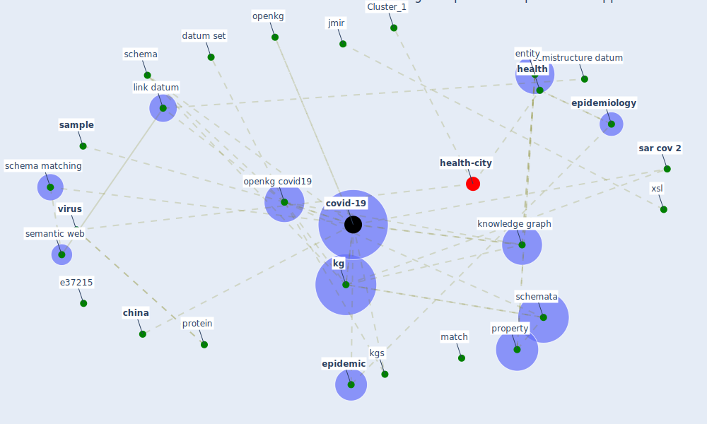

# Article: Construction of a Linked Data Set of COVID-19 Knowledge Graphs: Development and Applications (wang_construction_2022)

* Source: [10.2196/37215](https://doi.org/10.2196/37215)
* Year: 2022
* Cluster: [health-city](cluster_1)

## Keywords

 * annotator, babelnet, banff, bio2rdf, bioinformatic, biomedicine, biotechnology, category, character kg, [china](keyword_china), [chinese](keyword_chinese), class, classification tree, [computer](keyword_computer), computer science, [coronavirus](keyword_coronavirus), covid 19 kgs, [covid-19](keyword_covid-19), covidgraph, crowdsource, database, [datum](keyword_datum), datum set, dbpedia, [diagnosis](keyword_diagnosis), [drug](keyword_drug), [e37215](keyword_e37215), encyclopedia kg, endpoint, entity, entity alignment, [epidemic](keyword_epidemic), [epidemiology](keyword_epidemiology), evaluation, falcon ao, freebase, full text, [gene](keyword_gene), [genome](keyword_genome), gstore, [health](keyword_health), [health care](keyword_health_care), health kg, houston, [infection](keyword_infection), [information](keyword_information), intelligent application, intelligent question answer, [italy](keyword_italy), jmir, [kg](keyword_kg), kgs, knowledge extraction, knowledge graph, label, li x, linguistic, link datum, linux, match, mrc, name convention, ncbi, [openkg](keyword_openkg), [openkg covid19](keyword_openkg_covid19), [pathogen](keyword_pathogen), plain text, precision, predicate, property, protein, recall, [research](keyword_research), [sample](keyword_sample), [sar cov 2](keyword_sar_cov_2), schema, schema design, schema matching, schema model, schemata, semantic, semantic search, semantic web, semistructure datum, [shanghai](keyword_shanghai), similarity, similarity measure, similarity vector, source, sparql, structured datum, subgraph, subject, tail entity, [treatment](keyword_treatment), tx, unstructured datum, [vaccine](keyword_vaccine), [virus](keyword_virus), xsl

## Concepts

 

## Neighbours

### Closest articles

* Risk Diagnosis and Mitigation System of COVID-19 Using Expert System and Web Scraping - [LINK](article_mufid_risk_2020)
* Exploring the Non-Medical impacts of Covid-19 using Natural Language Processing - [LINK](article_agade_exploring_2020)
* Attitudes towards outdoor and neighbour noise during the COVID-19 lockdown: A case study in London - [LINK](article_lee_attitudes_2021)
* How loneliness is talked about in social media during COVID-19 pandemic: Text mining of 4,492 Twitter feeds - [LINK](article_koh_how_2022)
* Assessing the health and hygiene performance of apartment buildings - [LINK](article_ho_assessing_2004)
* Digital Twin of COVID-19 Mass Vaccination Centers - [LINK](article_pilati_digital_2021)
* How Covid-19 Has Permanently Changed the Fitness Industry - [LINK](article_davalos_how_2021)

### Closest BPs

* Blueprint: Resilience in staffing and skills training - [LINK](bp_12)
* Blueprint: Installing high-efficiency air filters - [LINK](bp_11)
* Blueprint: Air Cleaning Plants - [LINK](bp_15)
